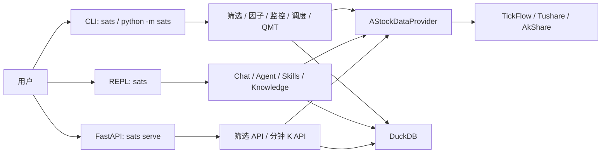

# SATS

> 面向 A 股研究的本地优先工具箱，提供筛选、信号分析、自然语言研究、知识库、监控、定时任务与受控 QMT 交易能力。

`README.md` 现在作为当前版本的主手册，只描述仓库里已经存在的行为。更深的架构和开发说明见 [docs/SATS_ARCHITECTURE.md](/Users/elliotge/python/SATS/docs/SATS_ARCHITECTURE.md) 与 [docs/SATS_MANUAL.md](/Users/elliotge/python/SATS/docs/SATS_MANUAL.md)。

## 目录

- [1. 项目定位与边界](#1-项目定位与边界)
- [2. 能力总览](#2-能力总览)
- [3. 安装与最小自检](#3-安装与最小自检)
- [4. 配置说明](#4-配置说明)
- [5. 三种入口：CLI / REPL / FastAPI](#5-三种入口cli--repl--fastapi)
- [6. 常用场景快速开始](#6-常用场景快速开始)
- [7. CLI 命令总览](#7-cli-命令总览)
- [8. 按命令族展开详解](#8-按命令族展开详解)
- [9. 数据源与数据真实性原则](#9-数据源与数据真实性原则)
- [10. LLM / Agent / Skills / Knowledge 工作方式](#10-llm--agent--skills--knowledge-工作方式)
- [11. 报告、历史、记忆、输出保存](#11-报告历史记忆输出保存)
- [12. 监控 / 调度 / QMT 风险边界](#12-监控--调度--qmt-风险边界)
- [13. API 端点](#13-api-端点)
- [14. 当前内置规则与限制](#14-当前内置规则与限制)
- [15. 测试与开发提示](#15-测试与开发提示)

## 1. 项目定位与边界

SATS 的核心定位不是“黑盒自动交易机器人”，而是一个**本地优先、数据优先、研究优先**的 A 股工作台：

- 用真实市场数据做筛选、分析、监控和研究。
- 用 LLM 帮你理解需求、组织证据、生成报告、解释结果。
- 用 DuckDB 把筛选结果、缓存、记忆、历史、监控和调度信息落到本地。
- 在你**显式允许**之前，不执行真实交易。

> **必须了解**
>
> - SATS 默认不自动交易。实盘相关能力只在显式命令或显式参数下开放。
> - LLM 不允许凭空编造行情、K 线、财务、新闻、热点或交易结论。
> - 定时任务执行的是 SATS 自己的 CLI argv 或聊天请求，不执行任意 shell 命令。
> - 业务层统一通过 `AStockDataProvider` 获取 A 股数据，不应直接在业务模块里接入第三方 provider。

## 2. 能力总览

### 你现在可能想做什么

| 目标 | 从这里开始 |
| --- | --- |
| 初始化环境并确认命令能跑起来 | [3. 安装与最小自检](#3-安装与最小自检) |
| 配置数据源、模型或 QMT | [4. 配置说明](#4-配置说明) |
| 先跑一次全市场筛选 | [6. 常用场景快速开始](#6-常用场景快速开始) |
| 用自然语言做个股 / 大盘 / 选股分析 | [5. 三种入口](#5-三种入口cli--repl--fastapi) 与 [10. LLM / Agent / Skills / Knowledge 工作方式](#10-llm--agent--skills--knowledge-工作方式) |
| 查 CLI 支持哪些命令 | [7. CLI 命令总览](#7-cli-命令总览) |
| 看某个命令怎么用 | [8. 按命令族展开详解](#8-按命令族展开详解) |
| 理解数据从哪里来、哪些字段会缺失 | [9. 数据源与数据真实性原则](#9-数据源与数据真实性原则) |
| 配监控、定时任务或 QMT | [12. 监控 / 调度 / QMT 风险边界](#12-监控--调度--qmt-风险边界) |

### 能力矩阵

| 能力域 | 主要入口 | 输出形式 | 说明 |
| --- | --- | --- | --- |
| 全市场规则筛选 | `screen`, `results`, `result-rules` | CLI 表格、DuckDB 结果 | 基于内置规则或生成规则做 A 股筛选 |
| 实时行情与技术指标 | `quote`, `indicators` | CLI 表格 / JSON | 查看实时价格、均线和日线技术指标 |
| 统一信号分析 | `analyze` | CLI 报告 / JSON | 对单股或已筛选结果跑 Analyze 信号体系 |
| 原生 DSA 与缠论分析 | `dsa`, `analyze-dsa`, `analyze-chan`, `chan-kb` | CLI 报告 / LLM 复核 | 原生 DSA、外部 DSA bridge、缠论规则与知识卡 |
| 自然语言选股与研究 | `chat`, `agent`, REPL 普通输入 | Markdown 风格回答、产物、trace | Agent-first 路由，必要时自动调研究工具 |
| 因子研究与选股 | `factor` | 报告 / JSON / 可写入筛选结果 | 支持因子列表、单因子分析、多因子选股、因子 ML |
| 公开网络证据 | `web` | 结构化结果 / CLI 展示 | 网页搜索、社交热榜、关键词命中 |
| 知识库与 skills | `knowledge`, `skills` | 本地知识块与技能列表 | RAG 检索和本地领域 skill 加载 |
| 关注列表与监控 | `watchlist`, `monitor`, `monitor-display` | DuckDB、终端面板 | 关注股、持仓、买入候选、实时监控仪表盘 |
| 调度与执行 | `schedule` | 任务表、运行记录 | 定时执行 SATS CLI 或聊天任务 |
| Broker / QMT | `qmt` | 资产、持仓、委托、成交、订单结果 | 受控实盘入口，支持 `--dry-run` |
| HTTP API | `serve` | FastAPI | 当前提供首页、健康检查、筛选和分钟 K 查询 |

### 系统总览



## 3. 安装与最小自检

### 环境要求

- Python `3.12+`
- macOS 或 Linux
- 建议使用虚拟环境

### 安装

```bash
git clone <repo-url>
cd SATS

python -m venv .venv
source .venv/bin/activate

pip install -r requirements.txt
pip install -e .
```

### 可选依赖

```bash
pip install -e ".[akshare]"  # 启用 AkShare 补充数据
pip install -e ".[ml]"       # 启用 Qlib / LightGBM / XGBoost 等因子 ML 依赖
pip install -e ".[deep]"     # 启用 PyTorch 深度学习依赖
```

### 最小自检

先确认模块入口和 console script 都可用：

```bash
.venv/bin/python -m sats --help
sats --help
```

正常情况下你会看到 27 个顶层命令，包括：

```text
init, screen, results, result-rules, quote, analyze, analyze-dsa, dsa,
analyze-chan, chan-kb, discover, chat, agent, web, model, memory, history,
knowledge, indicators, factor, skills, watchlist, monitor, monitor-display,
schedule, qmt, serve
```

> **安装排错**
>
> - 如果这里直接报 `ModuleNotFoundError`，通常说明依赖还没装全。
> - 如果 `python -m sats --help` 可用但 `sats --help` 不可用，通常是 `pip install -e .` 尚未执行成功。

## 4. 配置说明

### 生成 `.env`

```bash
sats init
sats init --overwrite
```

默认模板来自 `sats/config.py` 中的 `DEFAULT_ENV_CONTENT`，当前内容如下：

```env
# SATS local configuration
SATS_DB_PATH=data/sats.duckdb

# Market data
TUSHARE_TOKEN=
TUSHARE_TIMEOUT_SECONDS=30
TUSHARE_MAX_RETRIES=2
TICKFLOW_API_KEY=
TICKFLOW_BASE_URL=https://api.tickflow.org
TICKFLOW_TIMEOUT_SECONDS=30
TICKFLOW_MAX_RETRIES=3
WEB_SEARCH_TIMEOUT_SECONDS=10
WEB_SEARCH_CACHE_TTL_SECONDS=43200
SOCIAL_HOT_CACHE_TTL_SECONDS=300
WEB_SEARCH_MAX_RESULTS=10

# LLM model profiles
DEEPSEEK_PROVIDER=deepseek
DEEPSEEK_BASE_URL=https://api.deepseek.com/v1
DEEPSEEK_API_KEY=
DEEPSEEK_MODEL=deepseek-chat
DEEPSEEK_LIGHT_MODEL=deepseek-chat

XIAOMIMIMO_PROVIDER=mimo
XIAOMIMIMO_BASE_URL=https://api.xiaomimimo.com/v1
XIAOMIMIMO_API_KEY=
XIAOMIMIMO_MODEL=MiMo-72B-A27B
XIAOMIMIMO_LIGHT_MODEL=MiMo-72B-A27B

DEFAULT_MODEL=DEEPSEEK
DEFAULT_LIGHT_MODEL=XIAOMIMIMO
LLM_TEMPERATURE=0.0
LLM_TIMEOUT_SECONDS=120
LLM_MAX_RETRIES=2
# LLM_REASONING_EFFORT=medium

# Trading
TRADING_MODE=paper
MINIQMT_GATEWAY_URL=
MINIQMT_GATEWAY_TOKEN=
REQUIRE_TRADE_CONFIRMATION=true
SATS_BROKER_PROVIDER=
SATS_QMT_BRIDGE_URL=
SATS_QMT_TOKEN=
SATS_QMT_ACCOUNT_ID=
SATS_QMT_ACCOUNT_TYPE=STOCK
SATS_QMT_USERDATA_PATH=
SATS_QMT_SESSION_ID=
```

### 关键配置分组

| 分组 | 关键变量 | 说明 |
| --- | --- | --- |
| 本地存储 | `SATS_DB_PATH` | DuckDB 数据库路径，默认 `data/sats.duckdb` |
| Tushare | `TUSHARE_TOKEN` 等 | 补充股票列表、日线、`daily_basic`、资金流、财务、板块和情绪数据 |
| TickFlow | `TICKFLOW_API_KEY` 等 | 优先提供行情、K 线、分钟 K、实时 quote |
| 公开网络 | `WEB_SEARCH_*`, `SOCIAL_HOT_*` | 控制 `web search` 与 `web hot` 的超时、缓存和结果数 |
| LLM | `<PROFILE>_*`, `DEFAULT_MODEL`, `DEFAULT_LIGHT_MODEL` | 使用“模型配置组 + 默认选择”的方式管理主模型与轻量模型 |
| 交易 | `TRADING_MODE`, `REQUIRE_TRADE_CONFIRMATION` | 交易开关与确认策略 |
| QMT / MiniQMT | `SATS_QMT_*`, `MINIQMT_*` | Broker / bridge 连接配置 |

### 模型配置组

SATS 的模型配置采用固定命名模式：

```text
<PROFILE>_PROVIDER
<PROFILE>_BASE_URL
<PROFILE>_API_KEY
<PROFILE>_MODEL
<PROFILE>_LIGHT_MODEL
```

示例：

- `DEEPSEEK_PROVIDER=deepseek`
- `DEEPSEEK_MODEL=deepseek-chat`
- `XIAOMIMIMO_PROVIDER=mimo`
- `DEFAULT_MODEL=DEEPSEEK`
- `DEFAULT_LIGHT_MODEL=XIAOMIMIMO`

可通过命令查看和切换：

```bash
sats model status
sats model list
sats model use DEEPSEEK --target main
sats model use XIAOMIMIMO --target light
```

### QMT 兼容说明

当前配置层对 bridge URL 和 token 同时接受两套变量：

- `SATS_QMT_BRIDGE_URL`，若为空则回退到 `MINIQMT_GATEWAY_URL`
- `SATS_QMT_TOKEN`，若为空则回退到 `MINIQMT_GATEWAY_TOKEN`

这意味着如果你已经有旧的 `MINIQMT_*` 配置，当前版本仍会兼容读取。

## 5. 三种入口：CLI / REPL / FastAPI

### 5.1 一次性 CLI

```bash
sats <command> [options]
python -m sats <command> [options]
```

`sats` console script 与 `python -m sats` 复用同一套 `argparse` 命令注册，行为应保持一致。

### 5.2 交互式 REPL

```bash
sats
```

进入后提示符为 `sats>`，支持两类输入：

- **普通自然语言**：例如“用缠论分析 002436”“今天 A 股大盘分析，明天和下周走势预测”
- **slash 命令**：例如 `/screen`、`/chat`、`/knowledge`、`/qmt`

REPL 当前内置操作包括：

- `/help`：查看命令和示例
- `/new`：开启新对话
- `/save --format md|pdf`：保存上一条输出
- `/goal`：设置、查看或清除 Agent 目标
- `/confirm`、`/reject`：处理待确认 runtime 动作
- `/trace`：查看对话 turn trace
- `/memory`、`/history`：管理记忆与交互历史

### 5.3 FastAPI

```bash
sats serve
sats serve --host 127.0.0.1 --port 8000
```

当前 HTTP 面只暴露最小可用接口：

- `/`
- `/health`
- `POST /api/screen`
- `GET /api/screen/results`
- `GET /api/market/minute-k`

## 6. 常用场景快速开始

| 场景 | 命令 |
| --- | --- |
| 生成配置模板 | `sats init` |
| 跑一次全市场筛选 | `sats screen --trade-date 20260514 --rule price_volume_ma` |
| 查看通过股票 | `sats results --trade-date 20260514 --rule price_volume_ma --passed` |
| 看实时行情 | `sats quote --stocks 000001,600519.SH,紫光股份` |
| 跑统一信号分析 | `sats analyze --stocks 000938 --signals ma_kline,chan` |
| 跑原生 DSA | `sats dsa --stocks 000001,600519 --trade-date 20260514` |
| 跑缠论候选复核 | `sats analyze-chan --trade-date 20260514 --chan-rule chan_signals --top 20` |
| 自然语言短线选股 | `sats discover 推荐几只未来几天可能走强的 A 股` |
| 自然语言研究 | `sats chat 今天A股大盘分析，明天和下周走势预测` |
| 关闭 Agent-first 路由 | `sats chat --no-agent 帮我解释 price_volume_ma` |
| 搜公开网页证据 | `sats web search 贵州茅台 最新公告 --limit 5` |
| 看社交热榜 | `sats web hot --platforms weibo,zhihu,baidu --limit 20` |
| 搜本地知识库 | `sats knowledge search --query 三买 --knowledge chan --limit 6` |
| 同步股票名称代码库 | `sats knowledge sync-stock-basic` |
| 多因子选股 | `sats factor pick --profile balanced --trade-date 20260514 --top 20` |
| 启动监控 | `sats monitor start --rules chan_signals --interval 60` |
| 开仪表盘 | `sats monitor-display run --plain` |
| 添加定时聊天任务 | `sats schedule add --name morning-market --type chat --text "今天A股大盘分析" --daily --time 08:45` |
| 查看 QMT 持仓 | `sats qmt positions` |

### REPL 快速示例

```text
sats> 用缠论分析002436
sats> 继续分析它的三买结构
sats> /screen --trade-date 20260514 --rule price_volume_ma
sats> /results --trade-date 20260514 --passed
sats> /chat --no-memory 临时问题
sats> /save --format pdf
sats> /goal 明天按信号自动买入不超过2万
sats> /trace
```

## 7. CLI 命令总览

当前版本共有 **27 个顶层命令**。按功能家族可分为以下几组。

### 7.1 研究与筛选

| 命令 | 说明 |
| --- | --- |
| `init` | 生成 `.env` 模板 |
| `screen` | 按规则执行全 A 股筛选 |
| `results` | 查询筛选结果 |
| `result-rules` | 列出已保存结果中的规则名 |
| `quote` | 查看实时行情和均线 |
| `analyze` | 统一信号分析 |
| `analyze-dsa` | 调外部 `daily_stock_analysis` bridge |
| `dsa` | SATS 原生 DSA 分析 |
| `analyze-chan` | 缠论候选复核 |
| `chan-kb` | 搜本地缠论知识卡 |
| `discover` | 短线机会发现 / 自然语言选股 |
| `indicators` | 计算日线技术指标 |

### 7.2 聊天、模型与知识

| 命令 | 说明 |
| --- | --- |
| `chat` | 配置好的 LLM 聊天入口，默认 Agent-first |
| `agent` | 显式 Agent 任务入口 |
| `model` | 查看和切换模型 profile |
| `memory` | 管理聊天长期记忆 |
| `history` | 查询 REPL 交互历史 |
| `knowledge` | 管理本地知识库 |
| `skills` | 列出本地 SATS skills |

### 7.3 因子与公开网络

| 命令 | 说明 |
| --- | --- |
| `factor` | 因子列表、单因子分析、多因子选股、因子 ML |
| `web` | 网页搜索、社交热榜、关键词命中 |

### 7.4 监控、调度、交易与服务

| 命令 | 说明 |
| --- | --- |
| `watchlist` | 编辑关注列表 |
| `monitor` | 管理持仓 / 关注列表 / 买入候选与实时监控 |
| `monitor-display` | 展示终端监控仪表盘 |
| `schedule` | 管理定时任务 |
| `qmt` | QMT / MiniQMT 交易与同步 |
| `serve` | 启动 FastAPI 服务 |

## 8. 按命令族展开详解

下面按用户最常见的工作流展开，每个命令只保留当前版本最关键的用法、参数和注意事项。

### 8.1 筛选、行情与分析

#### `init`

- 用途：生成项目根目录 `.env` 模板。
- 入口：`sats init`、`python -m sats init`、REPL `/init`
- 常用参数：`--overwrite`

```bash
sats init
sats init --overwrite
```

#### `screen`

- 用途：按规则执行全 A 股筛选，并把结果写入 DuckDB。
- 入口：CLI、REPL `/screen`
- 核心参数：`--rule`、`--trade-date`、`--select-watchlist`、`--no-select-watchlist`

```bash
sats screen --trade-date 20260514 --rule ma_volume_relative_strength
sats screen --trade-date 20260514 --rule price_volume_ma --no-select-watchlist
```

- 当前内置规则名见 [14. 当前内置规则与限制](#14-当前内置规则与限制)。

#### `results`

- 用途：查询筛选结果。
- 入口：CLI、REPL `/results`
- 核心参数：`--trade-date`、`--rule`、`--passed`

```bash
sats results --trade-date 20260514 --passed
sats results --trade-date 20260514 --rule price_volume_ma --passed
```

#### `result-rules`

- 用途：列出当前数据库里出现过的筛选规则名。
- 入口：CLI、REPL `/result-rules`

```bash
sats result-rules
```

#### `quote`

- 用途：查看实时行情与均线。
- 入口：CLI、REPL `/quote`
- 核心参数：`--stocks`
- 支持输入：6 位代码、`ts_code`、股票名称

```bash
sats quote --stocks 000001,600519.SH,紫光股份
```

#### `indicators`

- 用途：计算指定股票的日线技术指标。
- 入口：CLI、REPL `/indicators`
- 核心参数：`--symbols`、`--trade-date`、`--lookback-days`、`--json`

```bash
sats indicators --symbols 000001.SZ --trade-date 20260514
sats indicators --symbols 紫光股份 --json
```

#### `analyze`

- 用途：运行统一 Analyze 信号系统。
- 入口：CLI、REPL `/analyze`
- 两种模式：
  - `analyze signals`：查看信号定义
  - `analyze --stocks ...` 或 `analyze --from-screened`：执行分析
- 核心参数：`--signals`、`--trade-date`、`--rule`、`--llm-review`、`--json`、`--noreport`

```bash
sats analyze signals --category kline
sats analyze --stocks 000938 --signals ma_kline,chan
sats analyze --from-screened --trade-date 20260514 --rule price_volume_ma --signals all
```

#### `analyze-dsa`

- 用途：通过已封装的 `daily_stock_analysis` bridge 分析股票。
- 入口：CLI、REPL `/analyze-dsa`
- 核心参数：`--stocks` 或 `--rule + --trade-date`

```bash
sats analyze-dsa --stocks 000001,600519
sats analyze-dsa --trade-date 20260514 --rule price_volume_ma
```

#### `dsa`

- 用途：运行 SATS 原生 DSA 分析。
- 入口：CLI、REPL `/dsa`
- 核心参数：`--stocks | --from-screened`、`--trade-date`、`--lookback-days`、`--explain-rating`、`--llm-timeout`、`--no-llm`

```bash
sats dsa --stocks 000001,600519 --trade-date 20260514
sats dsa --from-screened --trade-date 20260514 --rule price_volume_ma --explain-rating
sats dsa --stocks 000001 --no-llm
```

#### `analyze-chan`

- 用途：用缠论规则或保存的筛选结果做 LLM 复核。
- 入口：CLI、REPL `/analyze-chan`
- 核心参数：`--trade-date`、`--rule`、`--chan-rule`、`--top`、`--stocks`
- `--chan-rule` 仅支持：`chan_third_buy`、`chan_composite`、`chan_signals`

```bash
sats analyze-chan --stocks 000001 --chan-rule chan_signals
sats analyze-chan --trade-date 20260514 --rule chan_signals --top 20
```

#### `chan-kb`

- 用途：搜索本地缠论知识卡。
- 入口：CLI、REPL `/chan-kb`
- 当前子命令：`search`

```bash
sats chan-kb search 三买
```

#### `discover`

- 用途：运行自然语言短线机会发现。
- 入口：CLI、REPL `/discover`、聊天中自然语言选股问题
- 核心参数：`--trade-date`、`--signals`、`--limit`、`--candidate-limit`、`--hot-sector-days`、`--no-hot-sector`
- `query` 为可选自然语言请求；也可以只用参数模式运行

```bash
sats discover --limit 5
sats discover 推荐几只未来几天可能走强的 A 股
sats discover 新能源方向有哪些短线机会
```

### 8.2 聊天、Agent、模型与知识

#### `chat`

- 用途：配置好的 LLM 聊天入口，默认启用 Agent-first 路由。
- 入口：CLI、REPL 普通输入、REPL `/chat`
- 核心参数：
  - `--no-memory`
  - `--knowledge`
  - `--no-agent`
  - `--confirm`
  - `--reject`
  - `--trace`
  - `--auto-trade`、`--broker`、`--live-trading`、`--max-order-value` 等 Agent 交易门控参数

```bash
sats chat 帮我解释 price_volume_ma
sats chat --no-memory 临时问题
sats chat --knowledge chan 解释三买和背驰
sats chat --no-agent 帮我总结当前功能
sats chat --confirm act_xxxxxxxx
sats chat --trace turn_xxxxxxxx
```

- 普通 `sats chat` 与 REPL 普通输入默认走 Agent-first 路由；如果只想要纯聊天，使用 `--no-agent`。
- 聊天中可触发研究、报告、规则生成、受限回测等 runtime 动作；待确认动作需用 `--confirm` 或 REPL `/confirm`。

#### `agent`

- 用途：显式把一句自然语言当成 Agent 目标执行。
- 入口：CLI、REPL `/goal` 最终会转成 `agent`
- 核心参数：`--max-iterations`、`--command-timeout`、`--python-timeout` 及交易门控参数

```bash
sats agent 生成一份000001均线研究报告并保存
sats agent 筛选短线机会并保存报告
```

- 如果你只是日常问答、研究或选股，通常直接用 `sats chat` 或 REPL 普通输入就够了。

#### `model`

- 用途：查看和切换模型 profile。
- 子命令：`status`、`list`、`use`

```bash
sats model status
sats model list
sats model use DEEPSEEK --target main
sats model use XIAOMIMIMO --target light
```

#### `memory`

- 用途：管理聊天长期记忆。
- 子命令：`list`、`search`、`forget`、`clear`

```bash
sats memory list
sats memory search 股票
sats memory forget mem_xxxxxxxx
sats memory clear --yes
```

#### `history`

- 用途：查询 REPL 交互历史。
- 子命令：`list`、`search`、`show`、`delete`

```bash
sats history list --kind chat
sats history search 股票 --kind command
sats history show hist_xxxxxxxx
sats history delete hist_xxxxxxxx
```

#### `knowledge`

- 用途：管理本地 RAG 知识库。
- 子命令：`list`、`add`、`ingest`、`search`、`sync-stock-basic`

```bash
sats knowledge list
sats knowledge add --name chan --description "缠论规则和买卖点" --tags chan,缠论
sats knowledge ingest --knowledge chan --path knowledge/chan/rules --tags chan
sats knowledge search --query 三买 --knowledge chan --limit 6
sats knowledge sync-stock-basic
```

- `sync-stock-basic` 会把本地 `stock_basic` 缓存同步到 `stock-basic` 知识库，供股票名称解析和检索使用。

#### `skills`

- 用途：列出本地 SATS skills。
- 技能文件位置：`skills/<skill_id>/SKILL.md`

```bash
sats skills
```

### 8.3 因子与公开网络

#### `factor`

- 用途：因子元数据查询、单因子分析、多因子选股、因子 ML。
- 顶层子命令只包括：`list`、`show`、`analyze`、`pick`、`ml`

```bash
sats factor list --zoo barra_style
sats factor show --factor gtja191_001
sats factor analyze --factor gtja191_001 --trade-date 20260514
sats factor pick --profile balanced --trade-date 20260514 --top 20
```

`pick` 当前支持的 profile：

- `balanced`
- `short_term`
- `fundamental_quality`

`pick` 的常用参数：

- `--factors`
- `--trade-date`
- `--top`
- `--neutralize {none,industry}`
- `--weight {equal,ic}`
- `--profile`
- `--write-screening`

```bash
sats factor pick --profile balanced --trade-date 20260514 --top 20
sats factor pick --factors barra_style_value,barra_style_quality --trade-date 20260514 --top 20
sats factor pick --profile short_term --write-screening --screening-profile multi_factor
```

`ml` 子命令当前只包括：

- `status`
- `setup`
- `train`
- `evaluate`
- `predict`

```bash
sats factor ml status
sats factor ml setup
sats factor ml train --profile balanced --model lightgbm --train-start 20250101 --train-end 20260430 --valid-end 20260514
sats factor ml evaluate --model-run factor_ml_xxxxxxxx
sats factor ml predict --model-run factor_ml_xxxxxxxx --trade-date 20260514 --top 20
```

#### `web`

- 用途：引入只读的公开网络证据，不替代 SATS 自己的行情与财务数据。
- 子命令：`search`、`hot`、`mentions`

`search` 支持：

- `--limit`
- `--trusted-domains`
- `--freshness`，可选 `d/w/m/y`

```bash
sats web search 贵州茅台 最新公告 --limit 5
sats web search 贵州茅台 最新公告 --trusted-domains sse.com.cn,cninfo.com.cn --freshness w
```

`hot` 支持的平台来自 `sats/web/social_hot.py`：

- `weibo`
- `zhihu`
- `baidu`
- `douyin`
- `toutiao`
- `bilibili`
- `xueqiu_stock`
- `xueqiu_spot`

其中 `xueqiu` / `雪球` 会展开为 `xueqiu_stock,xueqiu_spot`。

```bash
sats web hot --platforms weibo,zhihu,baidu --limit 20
sats web hot --platforms xueqiu --limit 20
sats web mentions --keyword 贵州茅台
sats web mentions --keyword 贵州茅台 --platforms xueqiu
```

### 8.4 关注列表、监控与仪表盘

#### `watchlist`

- 用途：编辑监控使用的关注列表。
- 子命令：`list`、`add`、`remove`、`clear`、`select-delete`、`import-screened`

```bash
sats watchlist list
sats watchlist add --stocks 000001.SZ,600519.SH --note "长期关注"
sats watchlist remove --stocks 000001.SZ
sats watchlist import-screened --trade-date 20260514 --rule price_volume_ma
```

#### `monitor`

- 用途：管理持仓、关注列表、买入候选，并启动实时监控。
- 顶层子命令：`positions`、`watchlist`、`buy-candidates`、`start`、`run`、`stop`、`status`

持仓与列表管理：

```bash
sats monitor positions add --symbol 000001 --buy-price 10.5 --quantity 100 --buy-date 20260514
sats monitor positions list
sats monitor watchlist add --symbol 600519 --note "财报观察"
sats monitor buy-candidates list
```

启动监控：

```bash
sats monitor start --rules chan_signals --lists positions,watchlist --interval 60
sats monitor run --rules chan_signals --interval 60 --once
```

监控相关的交易限制参数包括：

- `--auto-trade`
- `--broker`
- `--max-order-value`
- `--max-position-pct`
- `--sell-ratio`

#### `monitor-display`

- 用途：显示终端监控仪表盘。
- 子命令：`start`、`run`、`stop`

```bash
sats monitor-display start --refresh 3
sats monitor-display run --plain
sats monitor-display stop
```

- `start` 支持 `--new-terminal` 在 macOS Terminal 新开窗口。
- `run --plain` 会输出一次纯文本快照，而不是 curses 面板。

### 8.5 调度、QMT 与 API 服务

#### `schedule`

- 用途：管理 SATS 定时任务。
- 子命令：`add`、`list`、`runs`、`enable`、`disable`、`remove`、`run`、`start`、`run-loop`、`stop`、`status`
- 任务类型只支持：
  - `cli`
  - `chat`

```bash
sats schedule add --name daily-discover --type chat --text "预测未来几天大概率上涨的股票" --daily --time 08:45
sats schedule add --name screen-open --type cli --text "screen --trade-date 20260514 --rule price_volume_ma --no-select-watchlist" --weekly --days mon,wed,fri --time 09:20
sats schedule list
sats schedule runs --limit 20
sats schedule run daily-discover
sats schedule start --interval 30
sats schedule run-loop --once
```

- 调度器运行的是 SATS argv 或聊天消息，不执行任意 shell。
- 不适合放进调度器的长时间常驻命令和服务命令会被限制。

#### `qmt`

- 用途：连接 MiniQMT / QMT broker，查询资产、持仓、委托、成交，或发送受控订单。
- 顶层子命令：`bridge`、`status`、`asset`、`positions`、`sync`、`orders`、`trades`、`buy`、`sell`、`cancel`

```bash
sats qmt status
sats qmt asset
sats qmt positions
sats qmt orders --open
sats qmt trades --limit 50
sats qmt sync positions --prune-missing
sats qmt buy --symbol 000001 --quantity 100 --price-type latest --dry-run
sats qmt sell --symbol 000001 --quantity 100 --price-type limit --price 12.34 --dry-run
sats qmt cancel --order-id order_xxxxxxxx
```

Windows 端推荐使用独立 bridge 脚本。把 [scripts/qmt_windows_bridge.py](/Users/elliotge/python/SATS/scripts/qmt_windows_bridge.py) 复制到已安装并登录国金证券 QMT/MiniQMT 的 Windows 机器，然后在能 `import xtquant` 的 Python 环境中运行：

```powershell
python qmt_windows_bridge.py ^
  --host 0.0.0.0 ^
  --port 8765 ^
  --qmt-path "C:\国金QMT\userdata_mini" ^
  --account-id <ACCOUNT_ID> ^
  --account-type STOCK ^
  --token "<RANDOM_TOKEN>"
```

跨机器访问时必须配置 token，并在 Windows 防火墙中允许 `8765` 端口入站。Mac 端 `.env` 配置示例：

```env
SATS_QMT_BRIDGE_URL=http://<Windows IP>:8765
SATS_QMT_TOKEN=<RANDOM_TOKEN>
SATS_QMT_ACCOUNT_ID=<ACCOUNT_ID>
SATS_QMT_ACCOUNT_TYPE=STOCK
```

配置后先验证连通和查询，再考虑实盘委托：

```bash
sats qmt status
sats qmt positions
sats qmt buy --symbol 000001 --quantity 100 --dry-run
```

如果 Windows 机器也安装了 SATS，也可以使用内置 bridge 子命令：

```bash
sats qmt bridge run --host 0.0.0.0 --port 8765 --qmt-path "C:\国金QMT\userdata_mini" --account-id <ACCOUNT_ID> --account-type STOCK --token "<RANDOM_TOKEN>"
```

#### `serve`

- 用途：启动 FastAPI 服务。
- 入口：CLI、REPL `/serve`

```bash
sats serve
sats serve --host 127.0.0.1 --port 8000
```

## 9. 数据源与数据真实性原则

### 统一数据门面

业务层统一通过 `sats.data.astock_provider.AStockDataProvider` 获取 A 股数据。用户层可以把这理解为：

- 不同数据源的差异由 SATS 自己在内部处理。
- 业务命令拿到的是统一格式的 A 股上下文。
- 如果某些字段缺失，SATS 会暴露缺失，而不是编造补全。

### 数据源角色

| 数据类型 | 主要来源 | 说明 |
| --- | --- | --- |
| 实时行情 / quote | TickFlow 优先 | 用于 `quote`、监控、实时研究 |
| 日线 / 分钟 K | TickFlow 优先 | 分析、监控、回测、缠论、信号 |
| `daily_basic` | Tushare | 换手率、流通市值、估值等 |
| 财务、资金流、股票列表 | Tushare | 基本面与股票基础资料 |
| 板块热点、涨跌停情绪 | Tushare | 市场情绪与热点上下文 |
| 市场宽度 / 部分补充数据 | AkShare 可选 | 补充性数据，不作为主行情来源 |
| 公开网页与热榜 | `ddgs` / 公开平台接口 | 只读证据，不替代结构化市场数据 |

### 数据真实性原则

- 市场数据必须来自 SATS 数据层，不允许 LLM 自造。
- 缺失字段应通过错误信息、空结果或 `missing_fields` 暴露。
- 搜索和社交热榜只作为**公开信息证据**，不替代行情、K 线、资金流和财务数据。
- 股票代码与名称输入统一走 `sats.symbols` / `stock_basic` 解析，不建议手工推断后缀。

### 本地缓存与存储

DuckDB 默认路径为 `data/sats.duckdb`，除了行情缓存外，还承担这些职责：

- 筛选结果
- 股票基础信息
- 聊天记忆与会话摘要
- REPL 交互历史
- 监控状态、持仓、事件
- 定时任务与运行记录
- QMT 订单和成交同步记录

## 10. LLM / Agent / Skills / Knowledge 工作方式

### 10.1 聊天不是“直接问模型”

当前 `sats chat` 与 REPL 普通输入的典型流程是：

1. 预处理自然语言意图。
2. 识别股票、交易日、研究方向、知识库需求。
3. 匹配本地 skills。
4. 必要时获取真实大盘 / 个股 / 指标 / 缠论 / 因子 / 机会发现上下文。
5. 最后再把这些结构化证据交给 LLM 总结与回答。

这也是为什么 SATS 会强调：

- 先取真实数据，再交给模型解释。
- 没有真实数据就直接说明限制。
- LLM 的角色是“理解、编排、解释、写报告”，不是“代替数据层”。

### 10.2 主模型与轻量模型

SATS 允许同时配置主模型与轻量模型：

- 主模型：复杂研究、深度复核、风险较高的生成动作
- 轻量模型：输入预处理、普通总结、记忆抽取、一些轻任务

日常查看和切换用 `sats model ...` 即可。

### 10.3 Agent-first 路由

默认情况下：

- `sats chat ...`
- REPL 普通输入
- REPL `/chat ...`

都会优先走 Agent-first 路由。常见工具类别包括：

- `research.*`
- `data.*`
- `factor.*`
- `chat.*`
- `sats_command.*`
- `trade.*`

如果你只想要一个“纯聊天解释器”，可以使用：

```bash
sats chat --no-agent 帮我解释当前命令结构
```

### 10.4 受限 Python 与回测

当前没有单独的顶层 `backtest` 命令。回测主要通过聊天 / Agent runtime 触发，内部使用 SATS-native 轻量回测能力。

受限 Python runtime 的边界在代码里写得很明确：

- 禁止 `import`
- 禁止 `open` / `exec` / `eval` / `compile`
- 禁止访问 `os`、`sys`、`subprocess`、`socket`、`pathlib`、`requests`、`urllib`、`shutil`
- 市场数据必须通过注入的 SATS resolver 获取，不能手写字面量行情

### 10.5 规则生成与确认

自然语言新增筛选规则时，SATS 走的是“先计划，再确认写入”的流程。

只有在同一会话里明确确认后，才会把代码写入：

```text
确认生成规则 <rule_name>
```

生成代码的目录固定为：

```text
sats/screening/rules/generated/
```

### 10.6 默认知识库集合

当前内置知识库集合来自 `sats/rag/knowledge.py`：

| 集合 | 主要内容 |
| --- | --- |
| `chan` | 缠论规则、买卖点、中枢、背驰 |
| `technical` | 技术指标、K 线、量能、波动率 |
| `signals` | SATS 信号分析、筛选规则、缠论信号 |
| `sentiment` | 市场情绪、热点板块、市场微结构 |
| `market` | 大盘、数据路由、行情数据源、市场助手 |
| `fundamental` | 基本面、财报、估值、财务筛选 |
| `risk` | 风险分析、监管、ST/退市/合规约束 |
| `stock-basic` | 股票名称、代码、行业、交易所映射 |

### 10.7 skills

本地 skills 位于：

```text
skills/<skill_id>/SKILL.md
```

SATS 会按消息内容自动匹配 skill，也支持你先用 `sats skills` 查看全量列表。

## 11. 报告、历史、记忆、输出保存

### 输出与报告

不少命令会生成 Markdown 报告或相关产物，例如：

- `analyze`
- `analyze-dsa`
- `dsa`
- `discover`
- `factor`
- 聊天 / Agent runtime 的报告与回测产物

报告通常写入工程下的 `reports/` 目录。

### REPL `/save`

REPL 可以把上一条输出保存为 Markdown 或 PDF：

```text
sats> /save --format md
sats> /save --format pdf
sats> /save --format md --path reports/custom/my_note.md
```

默认保存目录是：

```text
reports/saved_outputs/
```

### `history` 与 `memory` 的区别

| 维度 | `history` | `memory` |
| --- | --- | --- |
| 面向谁 | REPL 操作记录 | 聊天长期记忆 |
| 存什么 | 命令 / 聊天请求与输出 | 可被检索回注的长期信息 |
| 典型操作 | `list/search/show/delete` | `list/search/forget/clear` |
| 是否等同于对话全文 | 不是 | 也不是 |

### 记忆关闭方式

单次聊天可以关闭本地记忆：

```bash
sats chat --no-memory 临时问题
```

REPL 里也可以：

```text
sats> /chat --no-memory 临时问题
```

## 12. 监控 / 调度 / QMT 风险边界

> **高风险能力提醒**
>
> - 默认不自动交易。
> - 启用 Agent 交易或监控自动交易前，请先用 `noop` / `--dry-run` 验证流程。
> - `qmt buy/sell` 是明确的 broker 操作入口，执行前应确认连接、账户、数量和价格类型。

### 12.1 监控边界

- `monitor start/run` 会轮询行情与规则，服务对象是持仓、关注列表和买入候选。
- 自动交易必须显式传入 `--auto-trade` 与合适的 broker 选项。
- `monitor-display` 只是展示面板，不负责代替 `monitor` 做监控循环。

### 12.2 调度边界

- `schedule add` 只接受 `cli` 或 `chat` 类型任务。
- `--text` 的含义是：
  - `cli`：SATS CLI argv 文本
  - `chat`：要发送给聊天系统的消息
- 调度器不执行任意 shell，不适合作为通用任务系统。

### 12.3 QMT 边界

- `qmt buy/sell` 支持 `--dry-run`，建议先验证。
- live trading 是否允许，取决于命令入口与显式参数，不会因为“问了模型一句话”就自动下单。
- 若你走 `chat` / `agent` 路径，只有在显式传入：
  - `--auto-trade buy,sell`
  - `--broker qmt`
  - `--live-trading`

  这类门控参数后，系统才可能进入真实下单路径。

## 13. API 端点

当前 FastAPI 只暴露最小公开面：

| 路径 | 方法 | 说明 |
| --- | --- | --- |
| `/` | `GET` | 简易首页，列出当前筛选规则与 API 提示 |
| `/health` | `GET` | 健康检查 |
| `/api/screen` | `POST` | 执行筛选 |
| `/api/screen/results` | `GET` | 查询筛选结果 |
| `/api/market/minute-k` | `GET` | 查询分钟 K |

### 请求示例

执行筛选：

```bash
curl -X POST http://127.0.0.1:8000/api/screen \
  -H 'Content-Type: application/json' \
  -d '{"trade_date":"20260514","rule":"price_volume_ma"}'
```

查询筛选结果：

```bash
curl "http://127.0.0.1:8000/api/screen/results?trade_date=20260514&rule=price_volume_ma&passed=true"
```

查询分钟 K：

```bash
curl "http://127.0.0.1:8000/api/market/minute-k?symbols=000001.SZ&period=1m&mode=realtime&count=60"
```

## 14. 当前内置规则与限制

### 当前内置规则

当前注册在 `sats/screening/registry.py` 中的规则如下：

| 规则名 | 简述 |
| --- | --- |
| `chan_composite` | 缠论复合筛选，覆盖一买、二买、三买、中枢低吸和二三买重合 |
| `chan_signals` | 调用缠论引擎，汇总买卖信号与风险提示 |
| `chan_third_buy` | 日线箱体突破回抽后的三买代理结构，并结合 30 分钟确认 |
| `high_tight_flag` | 强势拉升后高位窄幅整理、缩量旗形 |
| `limit_up_shakeout` | 前一日强势后次日放量震荡 / 洗盘形态 |
| `ma_volume` | `MA5` 上穿 `MA20` 且成交量明显放大 |
| `ma_volume_relative_strength` | 温和上涨、量价配合、均线多头排列的相对强势筛选 |
| `monthly_base_breakout` | 长周期月线箱体突破或主升确认 |
| `price_volume_ma` | 涨幅、量能、换手、流通市值和均线多头排列的组合条件 |
| `rps_breakout` | RPS 强势突破 |
| `signal_composite` | 基于 Analyze 全量信号的综合筛选结果 |
| `turtle_trade` | 近 20 日高点突破的海龟交易风格规则 |
| `uptrend_limit_down` | 上升趋势中的极端下杀 / 放量洗盘形态 |

除了以上内置规则，`sats/screening/rules/generated/` 目录下的生成规则也会被自动发现并注册。

### 当前限制

- API 面当前只覆盖筛选与分钟 K，不等同于 CLI 全部能力。
- 很多研究能力依赖本地数据缓存与第三方数据源配置，没有配置好就会失败或返回缺失字段。
- `web search` 与 `web hot` 只能提供公开证据，不能替代结构化行情。
- 回测没有单独顶层 CLI 命令，主要通过聊天 / Agent runtime 触发。
- 即使配置了 LLM，SATS 仍然坚持“没有真实数据就不做伪造回答”。

## 15. 测试与开发提示

### 运行测试

```bash
pytest
```

如果你只想先看文档覆盖到的关键用户面，建议优先关注这些测试：

```bash
pytest tests/test_repl_cli.py
pytest tests/test_storage_and_api.py
pytest tests/test_chat_runtime.py
```

### 开发提示

- 命令入口统一在 `sats/cli.py`
- REPL 交互与 slash 命令统一在 `sats/repl.py`
- HTTP 入口在 `sats/api/app.py`
- 配置模板在 `sats/config.py`
- 规则注册表在 `sats/screening/registry.py`
- 知识库默认集合在 `sats/rag/knowledge.py`

### 文档更新建议

以后如果继续新增用户可调用能力，建议至少同步更新：

- `README.md`
- `sats/cli.py` 对应 help
- `sats/repl.py` 中的 `CLI_COMMANDS`、帮助文案和示例
- 必要时的 `docs/` 深度文档

这样可以避免 README 再次和真实实现漂移。
