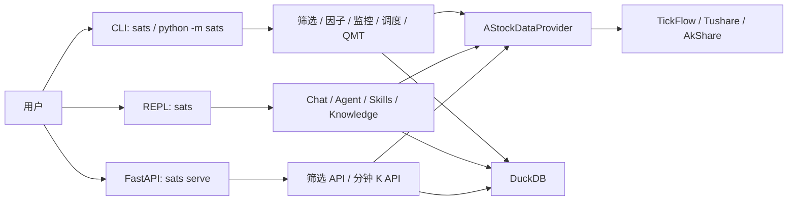

# SATS

> 面向 A 股研究的本地优先工具箱，提供筛选、信号分析、自然语言研究、知识库、监控、定时任务与受控 QMT 交易能力。

`README.md` 现在作为当前版本的主手册，只描述仓库里已经存在的行为。更深的架构和开发说明见 [docs/SATS_ARCHITECTURE.md](/Users/elliotge/python/SATS/docs/SATS_ARCHITECTURE.md) 与 [docs/SATS_MANUAL.md](/Users/elliotge/python/SATS/docs/SATS_MANUAL.md)。自然对话 Agent 和新 Agent 的统一能力入口见 [docs/AGENT_CAPABILITIES.md](/Users/elliotge/python/SATS/docs/AGENT_CAPABILITIES.md)。

## 目录

- [1. 项目定位与边界](#1-项目定位与边界)
- [2. 能力总览](#2-能力总览)
- [3. 安装与最小自检](#3-安装与最小自检)
- [4. 配置说明](#4-配置说明)
- [5. 三种入口：CLI / REPL / FastAPI](#5-三种入口cli--repl--fastapi)
- [6. 常用场景快速开始](#6-常用场景快速开始)
- [7. CLI 命令总览](#7-cli-命令总览)
- [8. 按命令族展开详解](#8-按命令族展开详解)
- [9. 数据源与数据真实性原则](#9-数据源与数据真实性原则)
- [10. LLM / Agent / Skills / Knowledge 工作方式](#10-llm--agent--skills--knowledge-工作方式)
- [11. 报告、历史、记忆、输出保存](#11-报告历史记忆输出保存)
- [12. 监控 / 调度 / QMT 风险边界](#12-监控--调度--qmt-风险边界)
- [13. API 端点](#13-api-端点)
- [14. 当前内置规则与限制](#14-当前内置规则与限制)
- [15. 测试与开发提示](#15-测试与开发提示)

## 1. 项目定位与边界

SATS 的核心定位不是“黑盒自动交易机器人”，而是一个**本地优先、数据优先、研究优先**的 A 股工作台：

- 用真实市场数据做筛选、分析、监控和研究。
- 用 LLM 帮你理解需求、组织证据、生成报告、解释结果。
- 用 DuckDB 把筛选结果、缓存、记忆、历史、监控和调度信息落到本地。
- 在你**显式允许**之前，不执行真实交易。

> **必须了解**
>
> - SATS 默认不自动交易。实盘相关能力只在显式命令或显式参数下开放。
> - LLM 不允许凭空编造行情、K 线、财务、新闻、热点或交易结论。
> - 定时任务执行的是 SATS 自己的 CLI argv 或聊天请求，不执行任意 shell 命令。
> - 业务层统一通过 `AStockDataProvider` 获取 A 股数据，不应直接在业务模块里接入第三方 provider。

## 2. 能力总览

### 你现在可能想做什么

| 目标 | 从这里开始 |
| --- | --- |
| 初始化环境并确认命令能跑起来 | [3. 安装与最小自检](#3-安装与最小自检) |
| 配置数据源、模型或 QMT | [4. 配置说明](#4-配置说明) |
| 先跑一次全市场筛选 | [6. 常用场景快速开始](#6-常用场景快速开始) |
| 用自然语言做个股 / 大盘 / 选股分析 | [5. 三种入口](#5-三种入口cli--repl--fastapi) 与 [10. LLM / Agent / Skills / Knowledge 工作方式](#10-llm--agent--skills--knowledge-工作方式) |
| 查 CLI 支持哪些命令 | [7. CLI 命令总览](#7-cli-命令总览) |
| 看某个命令怎么用 | [8. 按命令族展开详解](#8-按命令族展开详解) |
| 理解数据从哪里来、哪些字段会缺失 | [9. 数据源与数据真实性原则](#9-数据源与数据真实性原则) |
| 配监控、定时任务或 QMT | [12. 监控 / 调度 / QMT 风险边界](#12-监控--调度--qmt-风险边界) |

### 能力矩阵

| 能力域 | 主要入口 | 输出形式 | 说明 |
| --- | --- | --- | --- |
| 全市场规则筛选 | `screen`, `results`, `result-rules` | CLI 表格、DuckDB 结果 | 基于内置规则或生成规则做 A 股筛选 |
| 行情、区间涨跌与技术指标 | `quote`, `period-change`, `indicators` | CLI 表格 / JSON | 查看实时价格、区间涨跌幅、均线和日线技术指标 |
| 统一信号分析 | `analyze` | CLI 报告 / JSON | 对单股或已筛选结果跑 Analyze 信号体系 |
| 原生 DSA 与缠论分析 | `dsa`, `analyze-dsa`, `analyze-chan`, `chan-kb` | CLI 报告 / LLM 复核 | 原生 DSA、外部 DSA bridge、缠论规则与知识卡 |
| 原生个股深研 | `deep-analysis`, Agent 工具 `research.deep_stock_analysis` | CLI Markdown / JSON artifact；Agent 结构化数据 | A 股普通股票核心深研闭环：维度评分、投资人面板和综合摘要 |
| Serenity AI 卡位筛选 | `serenity-screen`, Agent 工具 `research.serenity_screen` | CLI Markdown / JSON artifact / DuckDB；Agent 结构化数据 | AI/科技供应链候选池、证据增强、卡位评分和风险罚分 |
| 投资委员会多团队分析 | `trading-committee` | 终端 Markdown / JSON artifact | 迁移 TradingAgents 风格的分析师、研究员、风控团队；数据由 SATS provider 提供 |
| 自然语言选股与研究 | `chat`, `agent`, REPL 普通输入 | Markdown 风格回答、显式报告产物、trace | conversation 默认路由，显式 Agent 可用于自主任务 |
| 因子研究与选股 | `factor` | 报告 / JSON / 可写入筛选结果 | 支持因子列表、单因子分析、多因子选股、因子 ML |
| 公开网络证据 | `web` | 结构化结果 / CLI 展示 | 网页搜索、社交热榜、关键词命中 |
| 知识库与 skills | `knowledge`, `skills`, `skillhub` | 本地知识块与技能列表 | RAG 检索、本地领域 skill 加载、问财 SkillHub skills 同步 |
| 关注列表与监控 | `watchlist`, `monitor`, `monitor-display` | DuckDB、终端面板 | 关注股、持仓、买入候选、实时监控仪表盘 |
| 盘中组合与模拟交易 | `portfolio`, Agent 工具 `workflow.daily_portfolio` | DuckDB、模拟账户、待确认实盘意图 | 盘中 10 选 5、市场闸门、1–4 日计划、自动模拟买卖 |
| 调度与执行 | `schedule` | 任务表、运行记录 | 定时执行 SATS CLI 或聊天任务 |
| Broker / QMT | `qmt` | 资产、持仓、委托、成交、订单结果 | 受控实盘入口，支持 `--dry-run` |
| HTTP API | `serve` | FastAPI | 当前提供首页、健康检查、筛选和分钟 K 查询 |

### 系统总览



## 3. 安装与最小自检

### 环境要求

- Python `3.12+`
- macOS 或 Linux
- 本仓库默认使用父目录共享环境 `/Users/elliotge/python/.venv`

### 安装

```bash
git clone <repo-url>
cd SATS

../.venv/bin/pip install -e ".[akshare]"
```

### 可选依赖

```bash
../.venv/bin/pip install -e ".[ml]"       # 启用 Qlib / LightGBM / XGBoost 等因子 ML 依赖
../.venv/bin/pip install -e ".[deep]"     # 启用 PyTorch 深度学习依赖
../.venv/bin/pip install -e ".[web-rag]"  # 启用本地 FastEmbed 网页向量检索
```

项目内的 `SATS/.venv` 保留用于兼容，但默认安装、测试和 CLI 验证统一使用父环境。父环境中 `mootdx` 对旧版 `httpx` 的声明与 SATS/Vibe Trading 使用的新版本存在已知冲突；不要为消除 `pip check` 警告而降级 `httpx`。

### 最小自检

先确认模块入口和 console script 都可用：

```bash
../.venv/bin/python -m sats --help
../.venv/bin/sats --help
```

正常情况下你会看到 33 个顶层命令，包括：

```text
init, screen, results, result-rules, quote, period-change, analyze, analyze-dsa, dsa,
deep-analysis, serenity-screen, trading-committee, analyze-chan, chan-kb, discover, chat, agent, web, model, memory, history,
knowledge, indicators, factor, skills, watchlist, monitor, monitor-display,
schedule, qmt, portfolio, catalog, serve
```

> **安装排错**
>
> - 如果这里直接报 `ModuleNotFoundError`，通常说明依赖还没装全。
> - 如果 `../.venv/bin/python -m sats --help` 可用但 `../.venv/bin/sats --help` 不可用，通常是 editable 安装尚未执行成功。

## 4. 配置说明

### 生成 `.env`

```bash
sats init
sats init --overwrite
```

默认模板来自 `sats/config.py` 中的 `DEFAULT_ENV_CONTENT`，当前内容如下：

```env
# SATS local configuration
SATS_DB_PATH=data/sats.duckdb

# Market data
TUSHARE_TOKEN=
TUSHARE_TIMEOUT_SECONDS=30
TUSHARE_MAX_RETRIES=2
TICKFLOW_API_KEY=
TICKFLOW_BASE_URL=https://api.tickflow.org
TICKFLOW_TIMEOUT_SECONDS=30
TICKFLOW_MAX_RETRIES=3
WEB_SEARCH_TIMEOUT_SECONDS=10
WEB_SEARCH_CACHE_TTL_SECONDS=43200
SOCIAL_HOT_CACHE_TTL_SECONDS=300
WEB_SEARCH_MAX_RESULTS=10
WEB_SEARCH_BACKEND=auto
WEB_SEARCH_PROVIDERS=anysearch,ddgs,bing
ANYSEARCH_API_KEY=
WEB_PAGE_CACHE_TTL_SECONDS=86400
WEB_RESPONSES_BASE_URL=
WEB_RESPONSES_API_KEY=
WEB_RESPONSES_MODEL=
WEB_SEARCH_CONTEXT_SIZE=auto
WEB_TAVILY_API_KEY=
WEB_BOCHA_API_KEY=
WEB_QUERIT_API_KEY=
WEB_EMBEDDING_PROVIDER=auto
WEB_EMBEDDING_BASE_URL=
WEB_EMBEDDING_API_KEY=
WEB_EMBEDDING_MODEL=
WEB_FASTEMBED_MODEL=sentence-transformers/paraphrase-multilingual-MiniLM-L12-v2

# LLM model profiles
DEEPSEEK_PROVIDER=deepseek
DEEPSEEK_BASE_URL=https://api.deepseek.com/v1
DEEPSEEK_API_KEY=
DEEPSEEK_MODEL=deepseek-chat
DEEPSEEK_LIGHT_MODEL=deepseek-chat

XIAOMIMIMO_PROVIDER=mimo
XIAOMIMIMO_BASE_URL=https://api.xiaomimimo.com/v1
XIAOMIMIMO_API_KEY=
XIAOMIMIMO_MODEL=MiMo-72B-A27B
XIAOMIMIMO_LIGHT_MODEL=MiMo-72B-A27B

DEFAULT_MODEL=DEEPSEEK
DEFAULT_LIGHT_MODEL=XIAOMIMIMO
LLM_TEMPERATURE=0.0
LLM_TIMEOUT_SECONDS=120
LLM_MAX_RETRIES=2
# LLM_REASONING_EFFORT=medium

# Trading
TRADING_MODE=paper
MINIQMT_GATEWAY_URL=
MINIQMT_GATEWAY_TOKEN=
REQUIRE_TRADE_CONFIRMATION=true
SATS_BROKER_PROVIDER=
SATS_QMT_BRIDGE_URL=
SATS_QMT_TOKEN=
SATS_QMT_ACCOUNT_ID=
SATS_QMT_ACCOUNT_TYPE=STOCK
SATS_QMT_USERDATA_PATH=
SATS_QMT_SESSION_ID=
```

### 关键配置分组

| 分组 | 关键变量 | 说明 |
| --- | --- | --- |
| 本地存储 | `SATS_DB_PATH` | DuckDB 数据库路径，默认 `data/sats.duckdb` |
| Tushare | `TUSHARE_TOKEN` 等 | 补充股票列表、日线、`daily_basic`、资金流、财务、板块和情绪数据 |
| TickFlow | `TICKFLOW_API_KEY` 等 | 优先提供行情、K 线、分钟 K、实时 quote |
| 公开网络 | `WEB_SEARCH_*`, `WEB_EMBEDDING_*`, `WEB_RESPONSES_*`, `SOCIAL_HOT_*` | 配置原生 RAG、多搜索源、网页索引、向量检索、Responses 兼容路径和社交热榜 |
| LLM | `<PROFILE>_*`, `DEFAULT_MODEL`, `DEFAULT_LIGHT_MODEL` | 使用“模型配置组 + 默认选择”的方式管理主模型与轻量模型 |
| 交易 | `TRADING_MODE`, `REQUIRE_TRADE_CONFIRMATION` | 交易开关与确认策略 |
| QMT / MiniQMT | `SATS_QMT_*`, `MINIQMT_*` | Broker / bridge 连接配置 |

### 模型配置组

SATS 的模型配置采用固定命名模式：

```text
<PROFILE>_PROVIDER
<PROFILE>_BASE_URL
<PROFILE>_API_KEY
<PROFILE>_MODEL
<PROFILE>_LIGHT_MODEL
```

示例：

- `DEEPSEEK_PROVIDER=deepseek`
- `DEEPSEEK_MODEL=deepseek-chat`
- `XIAOMIMIMO_PROVIDER=mimo`
- `DEFAULT_MODEL=DEEPSEEK`
- `DEFAULT_LIGHT_MODEL=XIAOMIMIMO`

可通过命令查看和切换：

```bash
sats model status
sats model ping --timeout 20
sats model list
sats model use DEEPSEEK --target main
sats model use XIAOMIMIMO --target light
```

默认自然对话会按任务重量分流：

- `DEFAULT_LIGHT_MODEL`：意图预处理、普通问答、命令帮助、记忆抽取/摘要、`chat.answer` 等轻量阶段。
- `DEFAULT_MODEL`：个股/大盘/缠论/选股分析的最终总结、复杂 runtime 工具循环、legacy Agent planner/replanner、Agent 最终研究总结等重型阶段。

重型分析不会先降到轻量模型；如果标准模型超时或失败，会使用 SATS 的本地 fallback/超时提示，而不是让轻量模型生成关键研究结论。

### QMT 兼容说明

当前配置层对 bridge URL 和 token 同时接受两套变量：

- `SATS_QMT_BRIDGE_URL`，若为空则回退到 `MINIQMT_GATEWAY_URL`
- `SATS_QMT_TOKEN`，若为空则回退到 `MINIQMT_GATEWAY_TOKEN`

这意味着如果你已经有旧的 `MINIQMT_*` 配置，当前版本仍会兼容读取。

## 5. 三种入口：CLI / REPL / FastAPI

### 5.1 一次性 CLI

```bash
sats <command> [options]
python -m sats <command> [options]
```

`sats` console script 与 `python -m sats` 复用同一套 `argparse` 命令注册，行为应保持一致。

所有命令结果遵循统一标识规则：出现股票代码时同时显示股票名称，出现指数代码时同时显示指数名称。名称优先来自本地 `stock_basic`，缺失时通过统一 `AStockDataProvider` 补齐。

### 5.2 交互式 REPL

```bash
sats
```

进入后提示符为 `sats>`，支持两类输入：

- **普通自然语言**：例如“用缠论分析 002436”“今天 A 股大盘分析，明天和下周走势预测”
- **slash 命令**：例如 `/screen`、`/chat`、`/knowledge`、`/qmt`

REPL 当前内置操作包括：

- `/help`：查看命令和示例
- `/new`：开启新对话
- `/save --format md|pdf`：保存上一条输出
- `/confirm`、`/reject`：处理待确认 runtime 动作
- `/trace`：查看对话 turn trace
- `/memory`、`/history`：管理记忆与交互历史

### 5.3 FastAPI

```bash
sats serve
sats serve --host 127.0.0.1 --port 8000
```

当前 HTTP 面只暴露最小可用接口：

- `/`
- `/health`
- `POST /api/screen`
- `GET /api/screen/results`
- `GET /api/market/minute-k`

## 6. 常用场景快速开始

| 场景 | 命令 |
| --- | --- |
| 生成配置模板 | `sats init` |
| 跑一次全市场筛选 | `sats screen --trade-date 20260514 --rule price_volume_ma` |
| 查看通过股票 | `sats results --trade-date 20260514 --rule price_volume_ma --passed` |
| 看实时行情 | `sats quote --stocks 000001,600519.SH,紫光股份` |
| 看近 60 天涨跌幅 | `sats period-change --stocks 000001,600519 --days 60` |
| 跑统一信号分析 | `sats analyze --stocks 000938 --signals ma_kline,chan` |
| 跑原生 DSA | `sats dsa --stocks 000001,600519 --trade-date 20260514` |
| 跑原生个股深研 | `sats deep-analysis --stocks 000001,600519 --trade-date 20260514` |
| 跑 Serenity AI 卡位筛选 | `sats serenity-screen --theme "AI半导体" --trade-date 20260514 --top 10` |
| 跑投资委员会分析 | `sats trading-committee --stocks 000001,600519 --trade-date 20260514` |
| 跑缠论候选复核 | `sats analyze-chan --trade-date 20260514 --chan-rule chan_signals --top 20` |
| 自然语言短线选股 | `sats discover 推荐几只未来几天可能走强的 A 股` |
| 自然语言研究 | `sats chat 今天A股大盘分析，明天和下周走势预测` |
| 生成自然语言研究报告 | `sats chat 生成一份000001均线研究报告并保存` |
| 使用旧聊天引擎 | `sats chat --engine legacy 帮我解释 price_volume_ma` |
| 查看对话线程 | `sats threads list` |
| 搜公开网页证据 | `sats web search 贵州茅台 最新公告 --limit 5` |
| 看社交热榜 | `sats web hot --platforms weibo,zhihu,baidu --limit 20` |
| 搜本地知识库 | `sats knowledge search --query 三买 --knowledge chan --limit 6` |
| 同步股票名称代码库 | `sats knowledge sync-stock-basic` |
| 多因子选股 | `sats factor pick --profile balanced --trade-date 20260514 --top 20` |
| 启动监控 | `sats monitor start --rules chan_signals --interval 60` |
| 开仪表盘 | `sats monitor-display run --plain` |
| 添加定时聊天任务 | `sats schedule add --name morning-market --type chat --text "今天A股大盘分析" --daily --time 08:45` |
| 查看 QMT 持仓 | `sats qmt positions` |

### REPL 快速示例

```text
sats> 用缠论分析002436
sats> 继续分析它的三买结构
sats> /screen --trade-date 20260514 --rule price_volume_ma
sats> /results --trade-date 20260514 --passed
sats> /period-change --indices 上证指数,沪深300 --days 180
sats> /chat --no-memory 临时问题
sats> /plan 用 price_volume_ma 筛选并对筛选股票制定明天交易计划
sats> /save --format pdf
sats> /trace
```

## 7. CLI 命令总览

当前版本共有 **33 个顶层命令**。按功能家族可分为以下几组。

### 7.1 研究与筛选

| 命令 | 说明 |
| --- | --- |
| `init` | 生成 `.env` 模板 |
| `screen` | 按规则执行全 A 股筛选 |
| `results` | 查询筛选结果 |
| `result-rules` | 列出已保存结果中的规则名 |
| `quote` | 查看实时行情和均线 |
| `period-change` | 查看股票或指数在近期自然日区间内的涨跌幅 |
| `analyze` | 统一信号分析 |
| `analyze-dsa` | 调外部 `daily_stock_analysis` bridge |
| `dsa` | SATS 原生 DSA 分析 |
| `deep-analysis` | 原生个股深研 |
| `serenity-screen` | Serenity AI/科技供应链卡位筛选 |
| `trading-committee` | 投资委员会多团队分析 |
| `analyze-chan` | 缠论候选复核 |
| `chan-kb` | 搜本地缠论知识卡 |
| `discover` | 短线机会发现 / 自然语言选股 |
| `indicators` | 计算日线技术指标 |

### 7.2 聊天、模型与知识

| 命令 | 说明 |
| --- | --- |
| `chat` | 配置好的自然语言入口，默认 Codex-style 工具循环 conversation |
| `agent` | 显式 Agent 任务入口 |
| `threads` | 管理 conversation 对话线程 |
| `repair` | 查看失败诊断并生成受控源码修复提案 |
| `model` | 查看和切换模型 profile |
| `memory` | 管理聊天长期记忆 |
| `history` | 查询 REPL 交互历史 |
| `knowledge` | 管理本地知识库 |
| `skills` | 列出本地 SATS skills |
| `catalog` | 动态查看命令、Agent tools、Skills、知识库和全部 provider 数据接口 |

### 7.3 因子与公开网络

| 命令 | 说明 |
| --- | --- |
| `factor` | 因子列表、单因子分析、多因子选股、因子 ML |
| `web` | 网页搜索、社交热榜、关键词命中 |

### 7.4 监控、调度、交易与服务

| 命令 | 说明 |
| --- | --- |
| `watchlist` | 编辑关注列表 |
| `monitor` | 管理持仓 / 关注列表 / 买入候选与实时监控 |
| `monitor-display` | 展示终端监控仪表盘 |
| `schedule` | 管理定时任务 |
| `qmt` | QMT / MiniQMT 交易与同步 |
| `serve` | 启动 FastAPI 服务 |

## 8. 按命令族展开详解

下面按用户最常见的工作流展开，每个命令只保留当前版本最关键的用法、参数和注意事项。

### 8.1 筛选、行情与分析

#### `init`

- 用途：生成项目根目录 `.env` 模板。
- 入口：`sats init`、`python -m sats init`、REPL `/init`
- 常用参数：`--overwrite`

```bash
sats init
sats init --overwrite
```

#### `screen`

- 用途：按规则执行全 A 股筛选，并把结果写入 DuckDB。
- 入口：CLI、REPL `/screen`
- 核心参数：`--rule`、`--trade-date`、`--select-watchlist`、`--no-select-watchlist`
- 当请求日期为当天且处于 A 股交易时段时，所有规则使用 TickFlow 当日 `1d` K 覆盖当天日线；规则声明需要的 `1m/5m/15m/30m/60m` 周期会合并历史窗口与对应当日分钟 K，`15min/15分钟` 会归一化为 `15m`，`10min/10分钟` 等整数分钟周期会由更细原生分钟线派生。批量上限分别为日 K 60 次/分、分钟 K 30 次/分，每次最多 100 个标的。

```bash
sats screen --trade-date 20260514 --rule ma_volume_relative_strength
sats screen --trade-date 20260514 --rule price_volume_ma --no-select-watchlist
```

- 当前内置规则名见 [14. 当前内置规则与限制](#14-当前内置规则与限制)。

#### `results`

- 用途：查询筛选结果。
- 入口：CLI、REPL `/results`
- 核心参数：`--trade-date`、`--rule`、`--passed`

```bash
sats results --trade-date 20260514 --passed
sats results --trade-date 20260514 --rule price_volume_ma --passed
```

#### `result-rules`

- 用途：列出当前数据库里出现过的筛选规则名。
- 入口：CLI、REPL `/result-rules`

```bash
sats result-rules
```

#### `quote`

- 用途：查看实时行情与均线。
- 入口：CLI、REPL `/quote`
- 核心参数：`--stocks`
- 支持输入：6 位代码、`ts_code`、股票名称

```bash
sats quote --stocks 000001,600519.SH,紫光股份
```

#### `period-change`

- 用途：计算股票或指数从今天向前指定自然日数的区间涨跌。
- 入口：CLI、REPL `/period-change`
- 核心参数：`--stocks` 或 `--indices` 二选一，另需 `--days`
- 计算口径：开始价和结束价均为最接近目标日期的可用日线收盘价；会显示实际采用的开始、结束交易日、涨跌额和涨跌幅。
- 股票支持多个代码或名称；指数支持完整代码及常用名称，如上证指数、深证成指、创业板指、沪深300、中证500、科创50。

```bash
sats period-change --stocks 000001,600519.SH,紫光股份 --days 60
sats period-change --indices 上证指数,沪深300 --days 180
python -m sats period-change --indices 000001.SH,399001.SZ --days 60
```

#### `indicators`

- 用途：计算指定股票的日线技术指标。
- 入口：CLI、REPL `/indicators`
- 核心参数：`--stocks`、`--trade-date`、`--lookback-days`、`--json`

```bash
sats indicators --stocks 000001.SZ --trade-date 20260514
sats indicators --stocks 紫光股份 --json
```

#### `analyze`

- 用途：运行统一 Analyze 信号系统。
- 入口：CLI、REPL `/analyze`
- 两种模式：
  - `analyze signals`：查看信号定义
  - `analyze --stocks ...` 或 `analyze --from-screened`：执行分析
- 核心参数：`--signals`、`--trade-date`、`--rule`、`--llm-review`、`--json`、`--noreport`

```bash
sats analyze signals --category kline
sats analyze --stocks 000938 --signals ma_kline,chan
sats analyze --from-screened --trade-date 20260514 --rule price_volume_ma --signals all
```

#### `analyze-dsa`

- 用途：通过已封装的 `daily_stock_analysis` bridge 分析股票。
- 入口：CLI、REPL `/analyze-dsa`
- 核心参数：`--stocks` 或 `--rule + --trade-date`

```bash
sats analyze-dsa --stocks 000001,600519
sats analyze-dsa --trade-date 20260514 --rule price_volume_ma
```

#### `dsa`

- 用途：运行 SATS 原生 DSA 分析。
- 入口：CLI、REPL `/dsa`
- 核心参数：`--stocks | --from-screened`、`--trade-date`、`--lookback-days`、`--explain-rating`、`--llm-timeout`、`--no-llm`

```bash
sats dsa --stocks 000001,600519 --trade-date 20260514
sats dsa --from-screened --trade-date 20260514 --rule price_volume_ma --explain-rating
sats dsa --stocks 000001 --no-llm
```

自然对话 Agent 会把 `DAS` 视为 `DSA` 的同义输入，并按策略词自动组合内建工具：

- “均线金叉 / 金蜘蛛” -> `analyze_signals(signals=ma)` + `native_dsa`
- “多头趋势 / 回踩低吸 / 放量突破” -> `analyze_signals(signals=ma,trendline,kline)` + `native_dsa`
- “缠论 / 一买 / 二买 / 三买 / 中枢 / 背驰” -> `chan_context` + `analyze_signals(signals=chan)` + `native_dsa`
- “波浪理论 / 艾略特” -> `analyze_signals(signals=wave)` + `native_dsa`
- “热点题材 / 龙头 / 情绪周期” -> `native_dsa` + `market_context(hot_sectors)`；若用户问“最新/发酵/新闻”，追加公开 web/社媒证据
- “事件驱动 / 公告 / 并购 / 订单 / 政策催化” -> `stock_context` + 公开 web 证据；没有公开证据时不会编造事件
- “成长品质 / ROE / 利润质量 / 预期重估” -> `factor_summary` + 必要的公开证据；需要完整投研时使用 `deep-analysis`

#### `deep-analysis`

- 用途：运行 SATS 原生 A 股普通股票深研闭环。
- 入口：CLI、REPL `/deep-analysis`、Agent 工具 `research.deep_stock_analysis`
- 核心参数：`--stocks`、`--trade-date`、`--phase run|collect|score|panel|report`、`--lookback-days`、`--json`、`--noreport`、`--no-llm`
- CLI / REPL 命令默认行为：终端直接显示 Markdown 研究报告；未加 `--noreport` 时同时写入 Markdown / JSON artifact。
- Agent 工具行为：`research.deep_stock_analysis` 只返回结构化深研数据，不单独写 reports；若用户明确要求保存报告，由最终汇总后调用 `research.write_report`。

```bash
sats deep-analysis --stocks 000001,600519 --trade-date 20260514
sats deep-analysis --stocks 000001 --phase panel --json --noreport
```

v1 只覆盖 A 股普通股票。港股、美股、ETF、LOF、可转债和 HTML 视觉报告不在当前范围内；取不到的维度会显式标记为数据缺口。

#### `serenity-screen`

- 用途：按 Serenity 方法对 A 股 AI/科技供应链做两阶段卡位筛选。
- 入口：CLI、REPL `/serenity-screen`、Agent 工具 `research.serenity_screen`
- 核心参数：`--theme`、`--stocks`、`--trade-date`、`--top`、`--candidate-limit`、`--lookback-days`、`--json`、`--noreport`、`--no-llm`
- CLI / REPL 命令默认行为：终端显示完整 Markdown 排名报告；评估结果写入 `screening_results`，规则名为 `serenity_bottleneck`。
- Agent 工具行为：`research.serenity_screen` 只返回筛选评分、证据等级和风险罚分数据，不写 Markdown / JSON artifact；如需报告文件，由最终汇总后调用 `research.write_report`。

```bash
sats serenity-screen --theme "AI半导体" --trade-date 20260514 --top 10
sats serenity-screen --stocks 300394,688017 --trade-date 20260514 --no-llm
sats results --trade-date 20260514 --rule serenity_bottleneck --passed
```

自然语言 Agent 在显式提到 Serenity、卡位、卡脖子、稀缺层或供应链瓶颈时自动调用；AI、半导体、光通信、先进封装、算力电力散热或机器人主题与“选股/筛选/推荐”组合出现时也会自动调用。普通短线机会发现的底层 `discover`/`opportunity_discovery` 代码仍保留，但 `research.discover_opportunities` 暂不注册到默认 Agent 工具列表；显式指定其他筛选规则时其他规则优先。

#### `trading-committee`

- 用途：运行 SATS 原生投资委员会流程，按分析师团队、研究员团队、交易员、风控团队和组合经理顺序生成多团队结论。
- 入口：CLI、REPL `/trading-committee`
- 核心参数：`--stocks`、`--trade-date`、`--lookback-days`、`--debate-rounds`、`--risk-rounds`、`--json`、`--noreport`、`--no-llm`
- 默认行为：命令执行状态显示在终端，最终 Markdown 结果直接输出；未加 `--noreport` 时同时写入 Markdown / JSON artifact。若 LLM 调用失败，报告会显示 provider/model/base_url 和错误摘要，JSON artifact 会包含 `llm_diagnostics`。

```bash
sats trading-committee --stocks 000001,600519 --trade-date 20260514
sats trading-committee --stocks 000001 --no-llm --noreport
```

v1 只覆盖 A 股沪深普通股票。SATS 可提供日线、实时行情、技术指标、资金流、估值摘要、A 股市场宽度、涨跌停情绪、筹码和部分财报/公告/研报/互动问答数据；热点板块属于 SATS 可用但较重的扩展上下文，默认命令会跳过并在 `missing_fields` 标记，避免阻塞终端输出。StockTwits、Reddit、Yahoo/Alpha Vantage 全球新闻、美股 insider transaction、非 A 股/crypto 数据不会等价迁入，结果中会以 `missing_fields` 标记。

#### `analyze-chan`

- 用途：用缠论规则或保存的筛选结果做 LLM 复核。
- 入口：CLI、REPL `/analyze-chan`
- 核心参数：`--trade-date`、`--rule`、`--chan-rule`、`--top`、`--stocks`
- `--chan-rule` 仅支持：`chan_third_buy`、`chan_composite`、`chan_signals`

```bash
sats analyze-chan --stocks 000001 --chan-rule chan_signals
sats analyze-chan --trade-date 20260514 --rule chan_signals --top 20
```

#### `chan-kb`

- 用途：搜索本地缠论知识卡。
- 入口：CLI、REPL `/chan-kb`
- 当前子命令：`search`

```bash
sats chan-kb search 三买
```

#### `discover`

- 用途：运行自然语言短线机会发现。
- 入口：CLI、REPL `/discover`、聊天中自然语言选股问题
- 核心参数：`--trade-date`、`--signals`、`--limit`、`--candidate-limit`、`--hot-sector-days`、`--no-hot-sector`
- `query` 为可选自然语言请求；也可以只用参数模式运行

```bash
sats discover --limit 5
sats discover 推荐几只未来几天可能走强的 A 股
sats discover 新能源方向有哪些短线机会
```

### 8.2 聊天、模型与知识

#### `chat`

- 用途：配置好的自然语言入口，默认启用 Codex-style 工具循环 conversation 引擎；旧聊天路径通过 `--engine legacy` 保留。
- 入口：CLI、REPL 普通输入、REPL `/chat`
- 核心参数：
  - `--no-memory`
  - `--knowledge`
  - `--engine conversation|legacy`
  - `--confirm`
  - `--reject`
  - `--trace`
  - `--plan-only`（兼容别名：Plan mode，只规划不执行）
  - `--dry-run`
  - `--auto-trade`、`--broker`、`--live-trading`、`--max-order-value` 等 Agent 交易门控参数

```bash
sats chat 帮我解释 price_volume_ma
sats chat --plan-only "用 price_volume_ma 筛选，并对筛选股票制定明天交易计划"
sats chat --dry-run "筛选结果按风险和信号强弱分组分析"
sats chat --no-memory 临时问题
sats chat --knowledge chan 解释三买和背驰
sats chat --engine legacy 帮我总结当前功能
sats chat --confirm act_xxxxxxxx
sats chat --trace turn_xxxxxxxx
```

- 普通 `sats chat`、REPL 普通输入和 `/chat` 默认走 conversation 工具循环：模型每轮只输出一个受控 JSON action，由 SATS 调用注册工具、记录 observation，再决定继续、澄清、确认或最终回答；如果只想要旧聊天路径，使用 `--engine legacy`。
- 自然语言选股不会在语义不匹配时静默使用默认规则。用户明确规则名或命中高置信规则语义时执行现有规则；否则 SATS 会基于日线、daily_basic、stock_basic 和相关 Skill 生成只在本轮有效的声明式临时规则。临时规则不生成 Python 文件、不写 `screening_results`，但可以复用正常行情缓存。
- 临时规则把用户明确要求作为硬条件，把 Skill 补充偏好作为软评分项。严格结果为空时不会自动放宽硬条件，而会返回带证券名称的近似候选、失败条件、数据日期和数据覆盖。数据或命令失败会与“市场中没有股票通过”分开报告。
- 回复“保存这个规则”会把本会话最后一次已执行的临时 spec 转成待确认规则计划；只有继续回复计划中显示的 `确认生成规则 <rule_name>` 后，才会写入 `sats/screening/rules/generated/`。
- 聊天中可触发研究、报告、规则生成、受限回测等 runtime 动作；待确认动作需用 `--confirm` 或 REPL `/confirm`。
- `--plan-only` 在 `sats chat` 中进入 Plan mode：只输出目标、判断、建议步骤、测试/验收和假设，不生成可自动执行的工具步骤，也不调用写库、命令、报告或交易工具。
- `--dry-run` 会跳过高风险副作用；筛选股票分析工作流可用于预览候选、模式和执行计划。

#### 受控自诊断与修复

所有注册 Agent 工具统一返回 `failure` 和 `recovery_attempts` envelope。SATS 会自动处理安全、确定性的运行时恢复：协议格式归一化、参数规范化、只读瞬态超时/连接重试、catalog 数据接口回退，以及 `analysis.python_program` 的受限代码修订。带副作用的命令、写库、审批和交易动作不会自动重放。

```bash
sats repair list
sats repair list --turn turn_xxxxxxxx
sats repair show repair_xxxxxxxx
sats repair show fail_xxxxxxxx
sats repair run --turn turn_xxxxxxxx
sats chat --confirm act_xxxxxxxx
sats chat --reject act_xxxxxxxx
```

REPL 对应入口为 `/repairs`、`/repair [TURN_ID]`、`/confirm ACTION_ID` 和 `/reject ACTION_ID`。源码补丁只有在失败定位到本仓库 Python 文件、运行时恢复耗尽、补丁通过临时隔离工作区中的 `git apply --check`、编译和目标 unittest 后才会形成待确认动作；确认时还会校验目标文件 SHA256。真实验证失败会尝试立即反向应用补丁。

配置项：

```dotenv
SATS_SELF_REPAIR_MODE=propose        # off | runtime | propose
SATS_SELF_REPAIR_MAX_ATTEMPTS=2
SATS_SELF_REPAIR_TIMEOUT_SECONDS=120
SATS_SELF_REPAIR_TEST_TIMEOUT_SECONDS=300
```

`propose` 是默认模式。它允许自动生成经过隔离验证的 `.patch` 和诊断 JSON，但不允许无确认修改真实源码、安装依赖、提交/推送代码、扩大权限或执行交易。

#### `model`

- 用途：查看、连通性检查和切换模型 profile。
- 子命令：`status`、`list`、`ping`、`use`

```bash
sats model status
sats model ping --timeout 20
sats model ping --json
sats model list
sats model use DEEPSEEK --target main
sats model use XIAOMIMIMO --target light
```

#### `memory`

- 用途：管理聊天长期记忆。
- 子命令：`list`、`search`、`forget`、`clear`

```bash
sats memory list
sats memory search 股票
sats memory forget mem_xxxxxxxx
sats memory clear --yes
```

#### `history`

- 用途：查询 REPL 交互历史。
- 子命令：`list`、`search`、`show`、`delete`

```bash
sats history list --kind chat
sats history search 股票 --kind command
sats history show hist_xxxxxxxx
sats history delete hist_xxxxxxxx
```

#### `knowledge`

- 用途：管理本地 RAG 知识库。
- 子命令：`list`、`add`、`ingest`、`search`、`sync-stock-basic`

```bash
sats knowledge list
sats knowledge add --name chan --description "缠论规则和买卖点" --tags chan,缠论
sats knowledge ingest --knowledge chan --path knowledge/chan/rules --tags chan
sats knowledge search --query 三买 --knowledge chan --limit 6
sats knowledge sync-stock-basic
```

- `sync-stock-basic` 会把本地 `stock_basic` 缓存同步到 `stock-basic` 知识库，供股票名称解析和检索使用。

#### `skills`

- 用途：列出本地 SATS skills。
- 技能文件位置：`skills/<skill_id>/SKILL.md`

```bash
sats skills
```

#### `skillhub`

- 用途：把同花顺问财 SkillHub 目录同步为 SATS 本地 generated skills。
- 子命令：`install`、`list`、`status`
- 凭据策略：SATS 只读取已有 `IWENCAI_API_KEY`、`IWENCAI_BASE_URL` 和 `IWENCAI_SKILLHUB_CLI` 环境变量；不会把 API key 写入命令参数、日志或生成的 `SKILL.md`。

```bash
sats skillhub install --all --dry-run
sats skillhub install --all
sats skillhub status
sats skillhub list --query 研报 --classify OFFICIAL
```

生成文件位于 `skills/skillhub-*/SKILL.md`，manifest 位于 `skills/.skillhub_manifest.json`。这些文件让自然对话、`/skills` 和 `sats catalog --section skills` 能发现 SkillHub 能力；真实行情、财务、新闻、公告等数据仍必须通过 SATS 注册工具和 `AStockDataProvider` 获取。

#### `catalog`

- 用途：自然对话 Agent 和集成方的统一、机器可读能力目录。
- 数据接口来自 `AStockDataProvider`、TickFlow、Tushare 和 AkShare 当前注册表。

```bash
sats catalog
sats catalog --section providers --provider tushare --query 资金流 --json
sats catalog --section providers --provider akshare --category 宏观经济 --limit 50 --json
```

### 8.3 因子与公开网络

#### `factor`

- 用途：因子元数据查询、单因子分析、多因子选股、因子 ML。
- 顶层子命令只包括：`list`、`show`、`analyze`、`pick`、`ml`

```bash
sats factor list --zoo barra_style
sats factor show --factor gtja191_001
sats factor analyze --factor gtja191_001 --trade-date 20260514
sats factor pick --profile balanced --trade-date 20260514 --top 20
```

`pick` 当前支持的 profile：

- `balanced`
- `short_term`
- `fundamental_quality`

`pick` 的常用参数：

- `--factors`
- `--trade-date`
- `--top`
- `--neutralize {none,industry}`
- `--weight {equal,ic}`
- `--profile`
- `--write-screening`

```bash
sats factor pick --profile balanced --trade-date 20260514 --top 20
sats factor pick --factors barra_style_value,barra_style_quality --trade-date 20260514 --top 20
sats factor pick --profile short_term --write-screening --screening-profile multi_factor
```

`ml` 子命令当前只包括：

- `status`
- `setup`
- `train`
- `evaluate`
- `predict`

```bash
sats factor ml status
sats factor ml setup
sats factor ml train --profile balanced --model lightgbm --train-start 20250101 --train-end 20260430 --valid-end 20260514
sats factor ml evaluate --model-run factor_ml_xxxxxxxx
sats factor ml predict --model-run factor_ml_xxxxxxxx --trade-date 20260514 --top 20
```

#### `web`

- 用途：引入只读的公开网络证据，不替代 SATS 自己的行情与财务数据。
- 子命令：`search`、`domains`、`batch`、`open`、`cache clear`、`hot`、`mentions`

`search` 支持：

- `--limit`
- `--trusted-domains`
- `--freshness`，可选 `d/w/m/y`
- `--context-size`，可选 `auto/medium/high`
- `--providers`，例如 `anysearch,ddgs,bing,tavily`
- `--domain`、`--sub-domain`、`--sub-domain-params`：AnySearch 垂直领域、子域与必填参数；垂直搜索前可用 `web domains` 发现能力。

```bash
sats web search 贵州茅台 最新公告 --limit 5
sats web search 贵州茅台 最新公告 --trusted-domains sse.com.cn,cninfo.com.cn --freshness w
sats web search "全面对比近期半导体政策" --context-size high --providers ddgs,bing
sats web domains --domain finance
sats web batch --query "OpenAI Responses API" --query "DuckDB Python API"
sats web search AAPL --domain finance --sub-domain finance.quote --sub-domain-params type=stock,symbol=AAPL,cn_code=
sats web open https://www.sse.com.cn/ --query 公告
sats web cache clear --expired-only
```

网络搜索后端：

- `WEB_SEARCH_BACKEND=auto` 或 `rag`：使用 SATS 原生 RAG 管线，不依赖 Responses API。
- `WEB_SEARCH_BACKEND=responses`：显式使用官方 OpenAI 或自托管 open-responses 兼容端点；失败后降级原生 RAG。
- `WEB_SEARCH_BACKEND=ddgs`：只使用 DDGS。
- `WEB_SEARCH_PROVIDERS=anysearch,ddgs,bing`：默认并发搜索并用加权 RRF 融合；AnySearch 权重为其他 provider 的 2 倍，可显式加入 `tavily`、`bocha`、`querit`。
- `ANYSEARCH_API_KEY`：可选；未配置时使用匿名访问。不要在命令参数或聊天消息中传递密钥。
- `WEB_TAVILY_API_KEY`、`WEB_BOCHA_API_KEY`、`WEB_QUERIT_API_KEY`：只有提供方被列入 `WEB_SEARCH_PROVIDERS` 时才使用。
- `WEB_EMBEDDING_PROVIDER=auto`：仅当 `WEB_EMBEDDING_MODEL` 是真实 embedding 模型、且配置的端点支持 OpenAI-compatible `/v1/embeddings` 时启用远程向量检索；聊天模型或不支持 embeddings 的网关应设为 `none`，直接使用关键词检索。
- `WEB_EMBEDDING_PROVIDER=fastembed`：使用可选本地模型，需先执行 `../.venv/bin/pip install -e ".[web-rag]"`。
- `WEB_RESPONSES_BASE_URL`、`WEB_RESPONSES_API_KEY`、`WEB_RESPONSES_MODEL`：由用户配置已经运行的 Responses 兼容服务；SATS 不负责安装或启动该服务。
- `WEB_SEARCH_CONTEXT_SIZE=auto`：普通问题使用 `medium`；明确要求深入、全面、对比或报告时使用 `high`。

原生管线会进行查询扩展、多源搜索、URL 去重、安全抓取、正文提取、独立 DuckDB 分块索引、关键词/向量混合召回、轻量模型重排和带引用综合。HTML 使用 `trafilatura`，PDF 使用 `pypdf`；不执行 JavaScript，不访问私网或回环地址。

自然对话 Agent 在涉及最新事件、公告、新闻、政策或公司近况时按需联网，并在正文使用 `[S1]` 形式的来源编号、末尾输出可点击来源表。网页内容始终按不可信外部证据处理，其中的命令或操作指令不会被执行。最新价、行情、K 线、成交量和资金流仍通过 SATS 结构化数据层获取。

`hot` 支持的平台来自 `sats/web/social_hot.py`：

- `weibo`
- `zhihu`
- `baidu`
- `douyin`
- `toutiao`
- `bilibili`
- `xueqiu_stock`
- `xueqiu_spot`

其中 `xueqiu` / `雪球` 会展开为 `xueqiu_stock,xueqiu_spot`。

```bash
sats web hot --platforms weibo,zhihu,baidu --limit 20
sats web hot --platforms xueqiu --limit 20
sats web mentions --keyword 贵州茅台
sats web mentions --keyword 贵州茅台 --platforms xueqiu
```

### 8.4 关注列表、监控与仪表盘

#### `watchlist`

- 用途：编辑监控使用的关注列表。
- 子命令：`list`、`add`、`remove`、`clear`、`select-delete`、`import-screened`

```bash
sats watchlist list
sats watchlist add --stocks 000001.SZ,600519.SH --note "长期关注"
sats watchlist remove --stocks 000001.SZ
sats watchlist import-screened --trade-date 20260514 --rule price_volume_ma
```

#### `monitor`

- 用途：管理持仓、关注列表、买入候选、可执行计划，并启动实时监控。
- 顶层子命令：`positions`、`watchlist`、`buy-candidates`、`plans`、`start`、`run`、`stop`、`status`

持仓由 QMT 自动同步，关注列表和买入候选仍按原方式管理：

```bash
sats monitor positions list
sats monitor watchlist add --symbol 600519 --note "财报观察"
sats monitor buy-candidates list
```

可执行计划以 DuckDB 为唯一事实源，通过版本化 JSON 导入。导入后的状态固定为草稿，必须显式启用：

```bash
sats monitor plans validate --file plan.json
sats monitor plans import --file plan.json
sats monitor plans list
sats monitor plans show --plan-id plan_xxxxxxxx
sats monitor plans activate --plan-id plan_xxxxxxxx
sats monitor plans disable-group --group-id group_xxxxxxxx
sats monitor plans disable-item --item-id item_xxxxxxxx
sats monitor plans disable --plan-id plan_xxxxxxxx
sats monitor plans remove --plan-id plan_xxxxxxxx
```

计划 JSON 顶层字段为 `schema_version`、`name`、`start_date`、`end_date`、`active_windows` 和 `items`。schema v1 继续兼容；schema v2 可引用组合市场状态和持仓状态。每只股票包含一个或多个 `trigger_groups`；组内条件全部满足才触发，不同组独立触发。支持：

- 对象：当前股票、支持的核心指数、`market` 或当前股票 `position`。
- 指标：`latest_price`、`change_points`、`pct_change`、`market_regime_score`、`position_pnl_pct`、`holding_trade_days`、`peak_drawdown_pct`。
- 运算符：`>=`、`>`、`<=`、`<`。
- 动作：`notify`、`buy`、`sell`。
- 仓位：`default`、`amount`、`shares`、`position_pct`。

计划首次评估即满足时会触发；之后仅在条件从不满足重新变为满足时触发。行情缺失不会触发，也不会重置条件状态。同一触发组每天仅第一次穿越允许进入买卖流程，后续穿越只记录提醒。真实下单仍必须显式配置 QMT 和 `--auto-trade`，并受全局金额、仓位及卖出比例限制。

启动监控：

```bash
sats monitor start --rules chan_signals --lists positions,watchlist --interval 60
sats monitor run --rules chan_signals --interval 60 --once
```

REPL 底部状态栏最右侧会显示 `monitor:run|stop`、`schedule:启用数/总数` 和 Portfolio paper 摘要
`pf:持仓数 仓仓位% 盈收益% 盘大盘分`；Portfolio 是否按时自动执行由 `schedule` 运行状态体现。

监控相关的交易限制参数包括：

- `--auto-trade`
- `--broker`
- `--max-order-value`
- `--max-position-pct`
- `--sell-ratio`

#### `monitor-display`

- 用途：显示终端监控仪表盘。
- 子命令：`start`、`run`、`stop`

```bash
sats monitor-display start --refresh 3
sats monitor-display run --plain
sats monitor-display stop
```

- `start` 支持 `--new-terminal` 在 macOS Terminal 新开窗口。
- `run --plain` 会输出一次纯文本快照，而不是 curses 面板。

#### `portfolio`

- 用途：执行盘中动态 10 选 5、组合风控和 1–4 个交易日计划。
- 默认 `paper` 模式全自动模拟买入、止盈、止损和时间止损。
- `live` 模式只生成待确认意图；每笔必须由用户执行 `orders approve` 后才会访问 QMT。

```bash
sats portfolio run --phase afternoon-scan --mode paper
sats portfolio run --phase afternoon-buy --mode paper
sats portfolio run --phase morning --mode paper
sats portfolio run --phase review --mode paper
sats portfolio run --phase report --mode paper
sats portfolio status --mode paper
sats portfolio candidates --selected
sats portfolio account --mode paper
sats portfolio positions --mode paper
sats portfolio trades --mode paper

sats portfolio run --phase afternoon-buy --mode live
sats portfolio orders list --mode live
sats portfolio orders approve --intent-id trade_intent_xxxxxxxx
sats portfolio orders reject --intent-id trade_intent_xxxxxxxx
```

组合规则：

- 大盘评分不低于 60 时总仓位上限 70%；45–59 时上限 35%；低于 45 停止新增买入。
- 单股目标仓位最多 14%，同一行业最多入选 2 只，每个扫描时点最多替换 2 只未成交候选。
- 常规新增买入只在 `afternoon-buy` 阶段执行；早盘、盘中复核、Monitor 重评和 14:40 计划固化阶段不新增买入。
- 14:10 `afternoon-scan` 初筛，14:25 `afternoon-buy` 最终 10 选 5 并买入，14:40 `plan-finalize` 固化下一交易日计划。
- 09:35/09:50 只执行条件卖出和复核，不默认清仓；风险卖出不受大盘买入闸门限制。
- 模拟盘遵守 100 股买入单位、资金约束、涨跌停不可成交和 A 股 T+1。
- 实盘审批默认 5 分钟过期；价格漂移超过 0.5% 或计划/风控失效时拒绝提交。
- `report` 阶段在 `reports/portfolio/YYYYMMDD/portfolio_daily_<mode>_<account>.md` 生成交易日 Markdown 总结。
- Monitor 跌破 Portfolio 硬止损时模拟盘立即卖出可用数量；其他风险信号进入 5 分钟去重复核队列并触发 `recheck`。

安装交易日调度：

```bash
sats portfolio schedule install --mode paper
sats portfolio schedule status
sats portfolio schedule remove
```

默认创建 09:35 `morning`、09:50 `morning-final`、10:30/13:00 `review`、14:10 `afternoon-scan`、14:25 `afternoon-buy`、14:40 `plan-finalize` 和 16:00 `report` 交易日任务。

### 8.5 调度、QMT 与 API 服务

#### `schedule`

- 用途：管理 SATS 定时任务。
- 子命令：`add`、`list`、`runs`、`enable`、`disable`、`remove`、`run`、`start`、`run-loop`、`stop`、`status`
- 任务类型只支持：
  - `cli`
  - `chat`

```bash
sats schedule add --name daily-discover --type chat --text "预测未来几天大概率上涨的股票" --daily --time 08:45
sats schedule add --name screen-open --type cli --text "screen --trade-date 20260514 --rule price_volume_ma --no-select-watchlist" --weekly --days mon,wed,fri --time 09:20
sats schedule add --name portfolio-afternoon-buy --type cli --text "portfolio run --phase afternoon-buy --mode paper" --trading-day --time 14:25
sats schedule list
sats schedule runs --limit 20
sats schedule run daily-discover
sats schedule start --interval 30
sats schedule run-loop --once
```

- 调度器运行的是 SATS argv 或聊天消息，不执行任意 shell。
- `--trading-day` 使用 A 股交易日历；周末和休市日记录为 skipped。
- 不适合放进调度器的长时间常驻命令和服务命令会被限制。

#### `qmt`

- 用途：连接 MiniQMT / QMT broker，查询资产、持仓、委托、成交，或发送受控订单。
- 顶层子命令：`bridge`、`status`、`asset`、`positions`、`orders`、`trades`、`buy`、`sell`、`cancel`

```bash
sats qmt status
sats qmt asset
sats qmt positions
sats qmt orders --open
sats qmt trades --limit 50
sats qmt buy --symbol 000001 --quantity 100 --price-type latest --dry-run
sats qmt sell --symbol 000001 --quantity 100 --price-type limit --price 12.34 --dry-run
sats qmt cancel --order-id order_xxxxxxxx
```

Windows 端推荐使用独立 bridge 脚本。把 [scripts/qmt_windows_bridge.py](/Users/elliotge/python/SATS/scripts/qmt_windows_bridge.py) 和同目录的 [qmt_windows_bridge.config.json](/Users/elliotge/python/SATS/scripts/qmt_windows_bridge.config.json) 一起复制到已安装并登录国金证券 QMT/MiniQMT 的 Windows 机器。

先编辑配置文件：

```json
{
  "host": "0.0.0.0",
  "port": 8765,
  "qmt_path": "C:\\国金QMT\\userdata_mini",
  "account_id": "<ACCOUNT_ID>",
  "account_type": "STOCK",
  "session_id": 0,
  "token": "<RANDOM_TOKEN>"
}
```

然后在能 `import xtquant` 的 Python 环境中直接运行：

```powershell
python qmt_windows_bridge.py
```

命令行参数会覆盖配置文件；例如临时改端口或 host 时可以这样运行：

```powershell
python qmt_windows_bridge.py ^
  --host 127.0.0.1 ^
  --port 9000
```

跨机器访问时必须配置 token，并在 Windows 防火墙中允许 `8765` 端口入站。Mac 端 `.env` 配置示例：

```env
SATS_QMT_BRIDGE_URL=http://<Windows IP>:8765
SATS_QMT_TOKEN=<RANDOM_TOKEN>
SATS_QMT_ACCOUNT_ID=<ACCOUNT_ID>
SATS_QMT_ACCOUNT_TYPE=STOCK
```

配置后先验证连通和查询，再考虑实盘委托：

```bash
sats qmt status
sats qmt positions
sats qmt buy --symbol 000001 --quantity 100 --dry-run
```

如果 Windows 机器也安装了 SATS，也可以使用内置 bridge 子命令：

```bash
sats qmt bridge run --host 0.0.0.0 --port 8765 --qmt-path "C:\国金QMT\userdata_mini" --account-id <ACCOUNT_ID> --account-type STOCK --token "<RANDOM_TOKEN>"
```

#### `serve`

- 用途：启动 FastAPI 服务。
- 入口：CLI、REPL `/serve`

```bash
sats serve
sats serve --host 127.0.0.1 --port 8000
```

## 9. 数据源与数据真实性原则

### 统一数据门面

业务层统一通过 `sats.data.astock_provider.AStockDataProvider` 获取 A 股数据。用户层可以把这理解为：

- 不同数据源的差异由 SATS 自己在内部处理。
- 业务命令拿到的是统一格式的 A 股上下文。
- 如果某些字段缺失，SATS 会暴露缺失，而不是编造补全。

### 数据源角色

| 数据类型 | 主要来源 | 说明 |
| --- | --- | --- |
| 实时行情 / quote | TickFlow 当日日 K | 使用当日 `1d` K 提取实时价格和盘中累计 OHLCV，并通过本地历史日线补齐昨收和涨跌幅 |
| 日线 / 分钟 K | TickFlow 优先 | 分析、监控、回测、缠论、信号 |
| `daily_basic` | Tushare | 换手率、流通市值、估值等 |
| 财务、资金流、股票列表 | Tushare | 基本面与股票基础资料；北向资金缺失时回退 AkShare 沪深港通接口 |
| 板块热点、涨跌停情绪 | Tushare | 市场情绪与热点上下文 |
| 市场宽度 | Tushare / TickFlow / AkShare / DuckDB | 收盘或历史日期使用全市场日线，盘中使用实时行情，失败后逐级回退 |
| 市场新闻与公告催化 | Tushare / AkShare | 输出有界的 `catalysts.news` 与 `catalysts.announcements`；单一来源无权限不等于整体缺失 |
| AkShare 数据字典 | AkShare 可选 | Tushare 未覆盖或无权限时的补充目录与只读取数 |
| 公开网页与热榜 | AnySearch + `ddgs` / 公开平台接口 | 只读证据，不替代结构化市场数据 |

AkShare 以“数据字典 + 白名单取数”的方式接入自然语言能力：Agent 会先查看 `data.list_provider_capabilities`，普通 A 股 quote/K 线/分钟 K 仍优先使用 TickFlow，Tushare 白名单继续走 Tushare；只有用户明确要求 AkShare，或需要宏观、行业、期货、期权、债券、基金等补充数据时，才会通过 `data.list_akshare_datasets` / `data.describe_akshare_dataset` / `data.get_akshare_data` 按需调用。AkShare 未安装时返回 `akshare:unavailable`，不会影响 SATS 主流程。

### 数据真实性原则

- 市场数据必须来自 SATS 数据层，不允许 LLM 自造。
- 缺失字段应通过错误信息、空结果或 `missing_fields` 暴露。
- 搜索和社交热榜只作为**公开信息证据**，不替代行情、K 线、资金流和财务数据。
- 股票代码与名称输入统一走 `sats.symbols` / `stock_basic` 解析，不建议手工推断后缀。

### 本地缓存与存储

DuckDB 默认路径为 `data/sats.duckdb`，除了行情缓存外，还承担这些职责：

- 筛选结果
- 股票基础信息
- 聊天记忆与会话摘要
- REPL 交互历史
- 监控状态、持仓、事件
- 定时任务与运行记录
- QMT 订单和成交同步记录

## 10. LLM / Agent / Skills / Knowledge 工作方式

### 10.1 聊天不是“直接问模型”

当前 `sats chat` 与 REPL 普通输入的典型流程是：

1. 预处理自然语言意图。
2. 识别股票、交易日、研究方向、知识库需求。
3. 匹配本地 skills。
4. 必要时获取真实大盘 / 个股 / 指标 / 缠论 / 因子 / 机会发现上下文。
5. 最后再把这些结构化证据交给 LLM 总结与回答。

这也是为什么 SATS 会强调：

- 先取真实数据，再交给模型解释。
- 没有真实数据就直接说明限制。
- LLM 的角色是“理解、编排、解释、写报告”，不是“代替数据层”。

### 10.2 主模型与轻量模型

SATS 允许同时配置主模型与轻量模型：

- 主模型：复杂研究、深度复核、风险较高的生成动作
- 轻量模型：输入预处理、普通总结、记忆抽取、一些轻任务

日常查看和切换用 `sats model ...` 即可。

### 10.3 Conversation 默认路由

默认情况下：

- `sats chat ...`
- REPL 普通输入
- REPL `/chat ...`

都会优先走 Codex-style conversation 工具循环：每轮先由模型选择 `call_tool`、`ask_clarification`、`request_confirmation` 或 `final_answer`，再由 SATS runtime 执行受控动作。常见工具类别包括：

- `catalog.*`
- `research.*`
- `data.*`
- `factor.*`
- `chat.*`
- `sats_command.*`
- `workflow.*`
- `trade.*`

自然语言 / Agent 工具默认只提供数据、证据和可综合素材，不单独写 `reports/`。最终回答由自然语言系统基于 observations 统一整合；只有用户明确要求保存、导出或写报告时，才通过 `research.write_report` 或最终 Agent 报告保存逻辑落盘。

不确定具体数据接口时，Agent 会先使用 `data.astock_catalog` 发现白名单 operation 或 dataset，再用 `data.astock_fetch` 取数。常规 A 股数据始终通过 `AStockDataProvider` 门面，不能用任意 Python 方法名绕过 provider 边界。

公司介绍、公司概况、主营业务、业务构成或基本面介绍请求会先把中文证券名称解析为规范 A 股代码，再调用 `research.internal_analysis(kind=company_fundamentals)`。该路径以 Tushare 的 `stock_company`、`fina_mainbz`、`daily_basic`、`fina_indicator` 和三张财务报表为主，不依赖日线行情；AkShare 仅在对应字段缺失且接口可用时补充。

`sats_command.catalog` 会列出除 `chat` 自递归入口之外的全部顶层 CLI 命令，`sats_command.run` 可通过 argv runner 调用这些命令。QMT 买卖和撤单仍受自动交易与实盘权限策略约束。

Conversation 工具循环执行步骤失败后，会把错误 observation 回填给下一轮模型动作选择：参数错误、未知工具或数据接口选择错误可由模型改用替代工具、提出澄清或最终说明；恢复仍受 `--max-iterations`、重复错误保护、交易权限、实盘权限和人工确认策略约束。需要用户确认、自动交易授权或直接人工审批的失败不会被自动绕过，会在最终总结里说明阻塞原因和下一步。

筛选股票分析类自然任务会优先走 `workflow.screened_stock_analysis`：先解析规则/交易日和候选上限，再按 `batch`、`group` 或 `per_stock` 分析模式生成次日交易计划素材。默认是集合分析；只有用户明确说“逐股/每只/逐一”或候选很少且要求详细时，才会逐股展开。

如果你只想要一个“纯聊天解释器”，可以使用：

```bash
sats chat --engine legacy 帮我解释当前命令结构
```

### 10.4 受限 Python 与回测

当前没有单独的顶层 `backtest` 命令。回测主要通过聊天 / conversation runtime 触发，内部使用 SATS-native 轻量回测能力。

受限 Python runtime 的边界在代码里写得很明确：

- 允许导入已安装模块
- 禁止 `open` / `exec` / `eval` / `compile` / 显式 `__import__`
- 禁止调用 `os`、`sys`、`subprocess`、`socket`、`pathlib`、`requests`、`urllib`、`shutil`、`importlib` 等危险根对象
- 市场数据必须通过注入的 SATS resolver 获取，不能手写字面量行情
- 受限程序可读取 `context["observations"]` 和按 `step_id` 索引的 `context["observations_by_step"]`；前序工具结构化结果优先从 `payload.result.payload` 读取，不要为了读取前序结果而解析 observation `content`

### 10.5 规则生成与确认

自然语言新增筛选规则时，SATS 走的是“先计划，再确认写入”的流程。

只有在同一会话里明确确认后，才会把代码写入：

```text
确认生成规则 <rule_name>
```

生成代码的目录固定为：

```text
sats/screening/rules/generated/
```

### 10.6 默认知识库集合

当前内置知识库集合来自 `sats/rag/knowledge.py`：

| 集合 | 主要内容 |
| --- | --- |
| `chan` | 缠论规则、买卖点、中枢、背驰 |
| `technical` | 技术指标、K 线、量能、波动率 |
| `price-action` | 阴线买入、开盘溢价率、量价关系、均线信号、520 均线、RSI 极值、趋势执行纪律、左右倍量、主力洗盘形态、短线仓位止损纪律 |
| `signals` | SATS 信号分析、筛选规则、缠论信号 |
| `sentiment` | 市场情绪、热点板块、市场微结构 |
| `market` | 大盘、数据路由、行情数据源、市场助手 |
| `fundamental` | 基本面、财报、估值、财务筛选 |
| `risk` | 风险分析、监管、ST/退市/合规约束 |
| `stock-basic` | 股票名称、代码、行业、交易所映射 |

### 10.7 skills

本地 skills 位于：

```text
skills/<skill_id>/SKILL.md
```

SATS 会按消息内容自动匹配 skill，也支持你先用 `sats skills` 查看全量列表。

`sats skillhub install --all` 会把问财 SkillHub 目录生成到 `skills/skillhub-*/SKILL.md`。这些 generated skills 是路由/方法论上下文，不代表已经执行外部问财 skill；自然对话可通过 `skillhub.search`、`skillhub.load` 和 `skillhub.status` 读取本地 SkillHub 元数据，再用 SATS 注册数据工具获取真实证据。

## 11. 报告、历史、记忆、输出保存

### 输出与报告

不少命令会生成 Markdown 报告或相关产物，例如：

- `analyze`
- `analyze-dsa`
- `dsa`
- `deep-analysis`
- `serenity-screen`
- `trading-committee`
- `discover`
- `factor`
- 聊天 / conversation runtime 的报告与回测产物

报告通常写入工程下的 `reports/` 目录。

### REPL `/save`

REPL 可以把上一条输出保存为 Markdown 或 PDF：

```text
sats> /save --format md
sats> /save --format pdf
sats> /save --format md --path reports/custom/my_note.md
```

默认保存目录是：

```text
reports/saved_outputs/
```

### `history` 与 `memory` 的区别

| 维度 | `history` | `memory` |
| --- | --- | --- |
| 面向谁 | REPL 操作记录 | 聊天长期记忆 |
| 存什么 | 命令 / 聊天请求与输出 | 可被检索回注的长期信息 |
| 典型操作 | `list/search/show/delete` | `list/search/forget/clear` |
| 是否等同于对话全文 | 不是 | 也不是 |

### 记忆关闭方式

单次聊天可以关闭本地记忆：

```bash
sats chat --no-memory 临时问题
```

REPL 里也可以：

```text
sats> /chat --no-memory 临时问题
```

## 12. 监控 / 调度 / QMT 风险边界

> **高风险能力提醒**
>
> - 默认不自动交易。
> - 启用 Agent 交易或监控自动交易前，请先用 `noop` / `--dry-run` 验证流程。
> - `qmt buy/sell` 是明确的 broker 操作入口，执行前应确认连接、账户、数量和价格类型。
> - `portfolio --mode paper` 会自动模拟交易，但不会访问 QMT；`portfolio --mode live` 始终逐笔人工确认。

### 12.1 监控边界

- `monitor start/run` 会轮询行情与规则，服务对象是持仓、关注列表和买入候选。
- 自动交易必须显式传入 `--auto-trade` 与合适的 broker 选项。
- `monitor-display` 只是展示面板，不负责代替 `monitor` 做监控循环。

### 12.2 调度边界

- `schedule add` 只接受 `cli` 或 `chat` 类型任务。
- `--text` 的含义是：
  - `cli`：SATS CLI argv 文本
  - `chat`：要发送给聊天系统的消息
- 调度器不执行任意 shell，不适合作为通用任务系统。

### 12.3 QMT 边界

- `qmt buy/sell` 支持 `--dry-run`，建议先验证。
- QMT 是持仓代码、成本价和数量的唯一事实源。`qmt positions`、`monitor positions list`、监控循环和监控面板都会自动刷新持仓。
- 只有完整且合法的 QMT 响应会替换本地快照；同步失败时保留上次成功快照，监控面板会显示 `STALE`、最后成功时间和错误。
- live trading 是否允许，取决于命令入口与显式参数，不会因为“问了模型一句话”就自动下单。
- 若你走 `chat` / `agent` 路径，只有在显式传入：
  - `--auto-trade buy,sell`
  - `--broker qmt`
  - `--live-trading`

  这类门控参数后，系统才可能进入真实下单路径。

`portfolio` 是更严格的例外：即使运行在 `live` 模式，也只创建待确认意图；必须由用户直接执行
`portfolio orders approve --intent-id ...`，Agent argv runner 会拒绝代替用户批准。

## 13. API 端点

当前 FastAPI 只暴露最小公开面：

| 路径 | 方法 | 说明 |
| --- | --- | --- |
| `/` | `GET` | 简易首页，列出当前筛选规则与 API 提示 |
| `/health` | `GET` | 健康检查 |
| `/api/screen` | `POST` | 执行筛选 |
| `/api/screen/results` | `GET` | 查询筛选结果 |
| `/api/market/minute-k` | `GET` | 查询分钟 K |

### 请求示例

执行筛选：

```bash
curl -X POST http://127.0.0.1:8000/api/screen \
  -H 'Content-Type: application/json' \
  -d '{"trade_date":"20260514","rule":"price_volume_ma"}'
```

查询筛选结果：

```bash
curl "http://127.0.0.1:8000/api/screen/results?trade_date=20260514&rule=price_volume_ma&passed=true"
```

查询分钟 K：

```bash
curl "http://127.0.0.1:8000/api/market/minute-k?symbols=000001.SZ&period=1m&mode=realtime&count=60"
curl "http://127.0.0.1:8000/api/market/minute-k?symbols=000001.SZ&period=10min&mode=history&start_date=20260606&end_date=20260606"
```

## 14. 当前内置规则与限制

### 当前内置规则

当前注册在 `sats/screening/registry.py` 中的规则如下：

| 规则名 | 简述 |
| --- | --- |
| `chan_composite` | 缠论复合筛选，覆盖一买、二买、三买、中枢低吸和二三买重合 |
| `chan_signals` | 调用缠论引擎，汇总买卖信号与风险提示 |
| `chan_third_buy` | 日线箱体突破回抽后的三买代理结构，并结合 30 分钟确认 |
| `high_tight_flag` | 强势拉升后高位窄幅整理、缩量旗形 |
| `limit_up_shakeout` | 前一日强势后次日放量震荡 / 洗盘形态 |
| `ma_volume` | `MA5` 上穿 `MA20` 且成交量明显放大 |
| `ma_volume_relative_strength` | 温和上涨、量价配合、均线多头排列的相对强势筛选 |
| `monthly_base_breakout` | 长周期月线箱体突破或主升确认 |
| `price_volume_ma` | 涨幅、量能、换手、流通市值和均线多头排列的组合条件 |
| `rps_breakout` | RPS 强势突破 |
| `signal_composite` | 基于 Analyze 全量信号的综合筛选结果 |
| `turtle_trade` | 近 20 日高点突破的海龟交易风格规则 |
| `uptrend_limit_down` | 上升趋势中的极端下杀 / 放量洗盘形态 |

除了以上内置规则，`sats/screening/rules/generated/` 目录下的生成规则也会被自动发现并注册。

### 当前限制

- API 面当前只覆盖筛选与分钟 K，不等同于 CLI 全部能力。
- 很多研究能力依赖本地数据缓存与第三方数据源配置，没有配置好就会失败或返回缺失字段。
- `web search` 与 `web hot` 只能提供公开证据，不能替代结构化行情。
- 回测没有单独顶层 CLI 命令，主要通过聊天 / conversation runtime 触发。
- 即使配置了 LLM，SATS 仍然坚持“没有真实数据就不做伪造回答”。

## 15. 测试与开发提示

### 运行测试

```bash
../.venv/bin/python -m unittest
```

如果你只想先看文档覆盖到的关键用户面，建议优先关注这些测试：

```bash
../.venv/bin/python -m unittest tests.test_repl_cli
../.venv/bin/python -m unittest tests.test_storage_and_api
../.venv/bin/python -m unittest tests.test_chat_runtime
```

### 开发提示

- 命令入口统一在 `sats/cli.py`
- REPL 交互与 slash 命令统一在 `sats/repl.py`
- HTTP 入口在 `sats/api/app.py`
- 配置模板在 `sats/config.py`
- 规则注册表在 `sats/screening/registry.py`
- 知识库默认集合在 `sats/rag/knowledge.py`

### 文档更新建议

以后如果继续新增用户可调用能力，建议至少同步更新：

- `README.md`
- `sats/cli.py` 对应 help
- `sats/repl.py` 中的 `CLI_COMMANDS`、帮助文案和示例
- 必要时的 `docs/` 深度文档

这样可以避免 README 再次和真实实现漂移。
