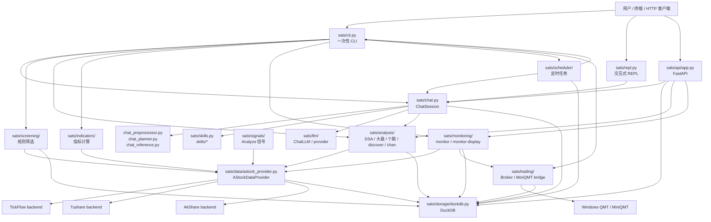
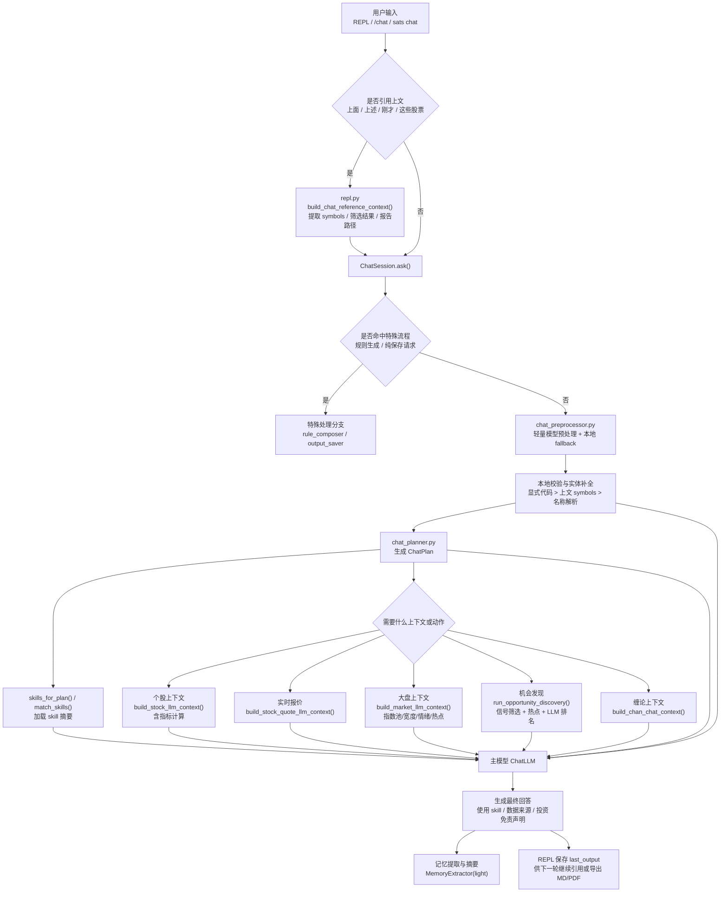

# SATS 开发者架构说明

最后更新：2026-05-28

本文档面向 SATS 的维护和二次开发，说明当前仓库中的主要架构、模块职责、数据流和扩展边界。它不替代 `README.md` 的安装和用户命令手册，也不定义尚未实现的新功能。

## 项目概览

SATS 是一个面向 A 股研究的本地分析系统，核心能力包括：

- 基于规则的股票筛选、结果查询和报告生成。
- 基于 Analyze 信号、热点板块和 LLM 排名的自然语言机会发现。
- 个股、大盘、缠论、DSA、指标、财务/估值等研究分析。
- 交互式 REPL、一次性 CLI、FastAPI 三种入口。
- LLM 聊天编排、Skills 加载、自然语言任务预处理、上下文衔接和输出保存。
- 关注列表、持仓监控、`monitor-display` 终端面板和定时任务。
- 受控 MiniQMT/QMT broker 接入，用于查询真实资产/持仓/委托/成交，并在显式命令或显式监控自动交易配置下发出实盘委托。
- DuckDB 本地存储，支持多终端共享同一数据库文件。

当前非目标：

- 不让聊天、LLM 工具或定时任务自主执行真实交易委托；实盘交易只能通过 SATS broker 白名单接口和显式命令/参数进入。
- 不允许聊天或定时任务执行任意 shell 命令。
- 不编造未获取的数据；缺失数据必须通过 `missing_fields` 或错误信息暴露。
- 不让业务层直接接入 TickFlow、Tushare、AkShare 等第三方 provider。

## 总体架构



### 分层原则

- 入口层：`sats/cli.py`、`sats/repl.py`、`sats/api/app.py` 负责解析用户输入和调用服务。
- 数据层：业务模块统一通过 `AStockDataProvider` 请求 A 股数据。
- 分析层：`screening`、`signals`、`analysis`、`indicators` 执行本地计算和 LLM 上下文构建。
- LLM 层：`sats/llm/` 封装模型调用，`skills` 提供领域提示，`chat` 负责规划和编排。
- 存储层：`DuckDBStorage` 负责表结构、缓存、筛选结果、聊天记忆、监控和调度记录。
- 展示层：CLI 文本、REPL、进度面板、`monitor-display`、FastAPI 响应。

## 核心模块说明

| 模块 | 职责 |
| --- | --- |
| `sats/cli.py` | argparse 命令注册和 `cmd_*` 处理器。`python -m sats ...` 与 console script 共用这里的入口。 |
| `sats/repl.py` | 交互式 SATS。负责 slash 命令、补全、帮助、聊天转发、上一条输出捕获、`/save`、上下文衔接。 |
| `sats/api/app.py` | FastAPI HTTP 服务，暴露筛选、结果、分析、监控等接口。 |
| `sats/config.py` | `.env` 和运行设置加载，包括数据库路径、LLM、数据源配置。 |
| `sats/data/astock_provider.py` | A 股数据统一门面。业务层只应该依赖它，不直接实例化底层 provider。 |
| `sats/data/tickflow_provider.py` | TickFlow backend adapter，优先用于行情、K 线、quote、分钟线等。 |
| `sats/data/tushare_provider.py` | Tushare backend adapter，用于股票基础信息、日线、daily_basic、资金流、财务、同花顺板块等。 |
| `sats/data/akshare_provider.py` | AkShare 可选补充 adapter，用于市场宽度、补充行情等；失败时应降级。 |
| `sats/storage/duckdb.py` | DuckDB 访问层。封装缓存、筛选结果、聊天、监控、调度等表的读写。 |
| `sats/screening/` | 筛选规则接口、注册表、服务、内置规则和自然语言生成规则运行时。 |
| `sats/signals/` | Analyze 信号系统，用于中短期技术信号、机会发现和分析辅助。 |
| `sats/analysis/` | 个股/大盘 LLM 上下文、DSA、daily_stock_analysis bridge、机会发现、缠论分析等。 |
| `sats/trading/` | Broker 抽象、MiniQMT HTTP client、Windows QMT bridge、持仓同步和监控自动交易 adapter。 |
| `sats/chan/` | 缠论引擎和结构识别。 |
| `sats/indicators/` | 技术指标计算，CLI `/indicators` 与自然语言个股分析共享底层计算能力。 |
| `sats/llm/` | LLM provider 抽象、OpenAI-compatible 调用、JSON 提取等工具。 |
| `sats/chat.py` | `ChatSession` 主编排：预处理、规划、取数、skills、工具调用、LLM 分析、记忆。 |
| `sats/chat_preprocessor.py` | 自然语言任务预处理，抽取意图、股票代码/名称、数据需求和 skill hints。 |
| `sats/chat_planner.py` | 规则式聊天计划器，决定需要哪些上下文和内部分析能力。 |
| `sats/chat_reference.py` | REPL 上下文引用，支持“上面/刚才/这些股票”等对上一条输出的引用。 |
| `sats/skills.py` | 本地 skill 列表、匹配和加载。实际 skill 文档位于 `skills/*/SKILL.md`。 |
| `sats/output_saver.py` | REPL 输出保存为 Markdown/PDF。 |
| `sats/progress.py` | 长耗时命令的统一进度面板，非 TTY、JSON、管道输出默认静默。 |
| `sats/monitoring/` | 持仓、关注列表、买入候选、监控事件、`monitor-display` 面板。 |
| `sats/scheduler/` | 定时任务定义、执行、运行记录和 CLI 管理。 |

## 功能细节

### 筛选与结果查询

主要入口：

- `sats screen --trade-date YYYYMMDD --rule <rule>`
- `sats results --trade-date YYYYMMDD --passed`
- REPL 中对应 `/screen`、`/results`

执行流程：

1. CLI 解析交易日、规则、股票范围等参数。
2. `screening` 服务通过 `AStockDataProvider` 获取筛选输入。
3. 规则从 `sats/screening/registry.py` 注册表加载。
4. 规则返回标准 `ScreeningResult`。
5. 结果写入 `screening_results`。
6. `results` 从 DuckDB 查询并格式化输出。

自然语言生成筛选规则走 `sats/screening/rule_composer.py`，固定流程是先生成计划、用户确认，再写入 `sats/screening/rules/generated/`，并由注册表动态发现。LLM 不直接写任意 Python 文件。

### Analyze 信号

主要入口：

- `sats analyze ...`
- `sats discover ...`

`sats/signals/` 中的信号系统会把 A 股日线等数据转成 `SignalInput`，再计算趋势、均线、K 线、图形、缠论、趋势线等事件。`discover` 默认使用偏中短期上涨的 `short_up` 信号组做全市场临时筛选，不写入 `screening_results`。

### 自然语言机会发现

主要入口：

- `sats discover`
- REPL 或 `sats chat` 中输入“预测未来几天大概率上涨的股票”等推荐类问题。

流程：

1. 聊天预处理和计划器识别为机会发现。
2. `run_opportunity_discovery()` 全市场读取数据并运行 Analyze 中短期上涨信号。
3. 本地筛选保留买入类信号、趋势不过弱、无明显强卖出压制的股票。
4. 热点板块上下文从 Tushare 同花顺行业/概念接口获取，并缓存到 DuckDB。
5. 热点加权是软优先，不硬排除非热点强信号股票。
6. 候选池做软分散，避免分数接近时集中在同一代码前缀、交易板块、行业或概念。
7. Top 候选补充个股、大盘、财务/估值等上下文后交给 LLM 二次排序。
8. LLM 不可用时返回本地排序并提示已使用本地信号排序。

### DSA 分析

主要入口：

- `sats dsa ...`
- `sats analyze-dsa ...`

原生 DSA 由 SATS 内部服务完成，默认仍会调用 LLM 复核，但使用短超时和熔断策略。第一次 LLM 超时、异常、非 JSON 或非法评级后，本轮剩余股票直接降级到本地规则评级，避免逐股长时间卡住。

原生 DSA 的报告结构靠近 `daily_stock_analysis` 的决策仪表盘：每只股票会生成信息面、核心结论、数据视角、战术计划、风险提示和数据源。上下文由 `AStockDataProvider` 统一提供，包含实时 quote、指标、资金流、基本面、筹码、市场阶段和热点板块；新闻/舆情 v1 不接入搜索源，只在 dashboard 与报告中明确标记为未启用和 `missing_fields`。

`analyze-dsa` 是对外部 daily_stock_analysis 的桥接路径，属于已封装的安全外部能力；聊天和定时任务不会开放自由 shell。

### 缠论分析

主要入口：

- `sats analyze-chan ...`
- `sats chan-kb search ...`
- 聊天中的缠论问题。

缠论分析由 `sats/chan/engine.py` 和 `sats/analysis/chan_*` 相关模块完成。知识检索使用 `sats/rag/chan_knowledge.py`，聊天计划器识别缠论意图后会加载 `chan-theory` skill，并构建缠论上下文。

### 技术指标

主要入口：

- `sats indicators <symbol>`
- 自然语言个股技术分析。

`/indicators` 是显式指标命令；自然语言股票分析不会 shell 调用该命令，但会复用 `sats/indicators/calculator.py` 里的 `IndicatorCalculator`，在个股上下文中提供 MA、量能、RSI、MACD 等计算结果。

### 聊天规划、预处理与 Skills

主要入口：

- `sats chat "问题"`
- REPL 普通输入
- REPL `/chat ...`

聊天执行顺序：

1. `ChatSession` 先处理自然语言生成筛选规则等特殊流程。
2. `chat_preprocessor` 使用短超时 LLM 做结构化预处理，抽取意图、股票代码、股票名称、交易日、是否引用上下文、是否需要大盘/指标/机会发现等。
3. 本地校验覆盖 LLM 输出：显式代码优先，上一条 REPL 引用其次，股票名称最后通过 DuckDB `stock_basic` 和 `AStockDataProvider` 解析。
4. `chat_reference` 在 REPL 中处理“上面/刚才/这些/列表”等引用上一条输出的问题；上一条是 `/results` 时会回查 `screening_results` 获取分数和规则。
5. `chat_planner` 合并预处理 hints 与规则判断，形成 `ChatPlan`。
6. `skills_for_plan()` 和 `match_skills()` 决定加载哪些 skill。
7. 根据计划构建个股、大盘、机会发现、缠论、财务等真实数据上下文。
8. LLM 只基于已注入的数据和可调用的白名单工具分析，不执行任意命令。

常见 skill：

- `sats-market-assistant`：大盘、选股、研究工作流。
- `technical-basic`：技术分析。
- `tickflow`、`tushare-data`、`akshare`：数据源说明。
- `chan-theory`：缠论。
- `financial-statement`、`valuation-model`、`risk-analysis`：财务、估值和风险。
- `sector-rotation`：热点板块和轮动。

### 当前自然语言处理流程

当前 SATS 的自然语言链路，不是“用户一句话直接丢给主模型回答”，而是先做本地编排，再把真实数据交给主模型分析。核心目标是避免模型凭空编造行情、指标、财务或筛选结果。

主流程：

1. 用户从三类入口进入：`sats chat "..."`、REPL 普通输入、REPL `/chat ...`。
2. REPL 会先检查这轮输入是否引用“上面/上述/刚才/这些股票/列表/结果”等上文；如果命中，就从上一条输出里提取股票代码、筛选结果或报告路径，构造 `ChatReferenceContext`。
3. `ChatSession.ask()` 先处理优先级更高的特殊流程，例如自然语言创建筛选规则；这类请求不会直接进入普通问答。
4. 轻量模型预处理 `chat_preprocessor` 运行短超时 LLM，把自然语言先整理成结构化任务：`intent`、`symbols`、`stock_names`、`trade_date`、`market_indices`、`market_dimensions`、`market_horizons`、`skill_hints`、是否需要个股/大盘/机会发现/实时报价等。
5. 本地规则会覆盖和校验轻量模型输出：显式股票代码优先，上文引用其次，股票名称最后通过 DuckDB `stock_basic` 和 `AStockDataProvider` 做解析；无法唯一匹配的名称才会进入澄清，而不是让模型猜代码。
6. `chat_planner` 把预处理结果和规则式识别合并成 `ChatPlan`，决定本轮需要哪些真实上下文、skills 和内部分析动作。
7. `skills_for_plan()` 与 `match_skills()` 选出要加载的 skill 文本，只作为领域提示，不代替真实数据。
8. 根据 `ChatPlan` 执行真实取数和内部分析：
   - 个股问题：`build_stock_llm_context()`，内部复用 `IndicatorCalculator` 计算 MA、RSI、MACD、量能等。
   - 报价问题：`build_stock_quote_llm_context()`。
   - 大盘问题：`build_market_llm_context()`，可按预处理规划的指数池、市场维度和 horizon 取数。
   - 自然语言选股：`run_opportunity_discovery()`，先做本地 Analyze 信号筛选、热点板块加权和候选增强，再交给主模型排序。
   - 缠论问题：`build_chan_chat_context()`。
9. 主模型只在“真实上下文已经准备好”的前提下回答；消息里会注入系统提示、skills 摘要、预处理结果、计划结果、上文引用上下文和结构化市场/个股数据。
10. 回答完成后，REPL 会记录本轮输出，供下一轮“分析上面股票”“输出为 PDF”“查看上面结果”继续复用；记忆提取和会话摘要则走轻量模型。

关键约束：

- 主模型不直接执行任意命令，不直接访问第三方数据源。
- A 股真实数据统一通过 `AStockDataProvider` 获取。
- 核心行情数据缺失时停止分析；辅助字段缺失时保留 `missing_fields`，不编造。
- 自然语言里的“上面/上述/上一条”优先触发上文继承，而不是重新要求用户输入股票代码。



### 输出保存

REPL 支持保存上一条输出或本轮输出：

- `保存上面结果为 MD/PDF`
- `/save --format md|pdf`
- `分析 000938 技术面，并保存结果为 PDF`

保存逻辑位于 `sats/output_saver.py`。默认输出到 `reports/saved_outputs/`。如果上一条输出包含 `报告: <path>` 且用户明确保存报告，可优先读取报告正文再保存或转 PDF。

### 关注列表与实时监控

主要入口：

- `sats watchlist ...`
- `sats monitor ...`
- `sats monitor-display ...`

`monitor` 管理持仓、关注列表、买入候选、监控事件和运行状态。`monitor-display` 是终端显示面板，当前样式为附件风格：

- 顶部外框标题 `monitor`。
- 左侧 `watchList`：`NO 股票代码 股票名称 价格 涨幅`。
- 右侧 `positions`：`NO 股票代码 股票名称 买入时间 成本价 数量 实时价格 盈亏 盈亏比`。
- 底部 `Info`：监控事件、建议、定时任务摘要和行情错误。

`monitor-display start` 默认在当前终端运行；`monitor-display start --new-terminal` 保留旧的 macOS Terminal 新窗口启动方式；`monitor-display run --plain` 输出纯文本快照。

### MiniQMT/QMT 实盘交易

主要入口：

- `sats qmt bridge run ...`
- `sats qmt status`
- `sats qmt asset`
- `sats qmt positions`
- `sats qmt sync positions`
- `sats qmt buy/sell/cancel ...`

交易模块位于 `sats/trading/`。SATS 主机侧通过 `MiniQmtBrokerClient` 访问 Windows bridge；Windows bridge 在安装并登录国金证券 QMT/MiniQMT 的环境中运行，运行时才导入 `xtquant`。Bridge 默认绑定 `127.0.0.1`；跨机器绑定 `0.0.0.0` 时必须配置 Bearer token。

交易边界：

- `buy` / `sell` CLI 默认是真实委托，`--dry-run` 只校验并写审计记录。
- 聊天和 LLM 工具不直接下单，只能解释或建议可运行命令。
- 监控自动交易默认关闭；只有 `monitor start/run --broker qmt --auto-trade buy,sell` 显式开启时才会根据监控信号下单。
- 委托、撤单、成交和同步持仓写入 broker 审计表；`qmt sync positions` 同步真实持仓到 `monitor_positions`，供 `monitor-display` 展示。

### 定时任务

主要入口：

- `sats schedule add ...`
- `sats schedule list`
- `sats schedule runs`
- `sats schedule start`
- `sats schedule run-loop`
- `sats schedule run <name>`

调度模块位于 `sats/scheduler/`。v1 支持每天、每周、指定星期几和固定时间，默认 `Asia/Shanghai` 时区。

任务类型：

- `cli`：执行 SATS 内部 CLI argv，例如 `screen --rule price_volume_ma`。
- `chat`：执行自然语言聊天任务，例如 `预测未来几天大概率上涨的股票，并保存结果为MD`。

安全边界：

- 不执行任意 shell。
- 禁止递归或长期阻塞命令，例如 `serve`、`schedule start`、`schedule run-loop`。
- 同一任务同时只允许一个实例运行。
- 运行记录写入 `scheduled_task_runs`，`monitor-display` 可展示最近执行摘要。

### FastAPI

主要入口：

- `sats serve --host 127.0.0.1 --port 8000`

FastAPI 位于 `sats/api/app.py`。它复用同一套存储、数据和分析服务，不拥有单独的数据访问逻辑。只有明确需要 HTTP 访问的能力才应添加 API route。

## 数据与存储

### AStockDataProvider

所有需要 A 股市场数据的业务模块应统一请求：

```python
from sats.data.astock_provider import AStockDataProvider
```

默认优先级：

1. TickFlow：行情、K 线、实时 quote、分钟 K 等优先使用。
2. Tushare：日线、指数、股票基础信息、daily_basic、资金流、财务、同花顺行业/概念板块、涨跌停/炸板情绪统计等。
3. AkShare：可选补充数据源，主要用于市场宽度、补充字段和降级。

返回数据应保留 `data_source`、`data_sources` 或 `missing_fields`。多源组合时记录组合来源，例如行情来自 TickFlow、估值来自 Tushare。核心数据完全缺失时应明确失败，辅助数据缺失时可继续但必须标记。

大盘上下文会通过 `load_limit_sentiment()` 增加 A 股情绪指标：涨停数、跌停数、炸板数、大盘系数、超短情绪、亏钱效应和阶段判断。该数据优先来自 Tushare `limit_list_d`；Tushare 不可用时只允许用实时 quote 近似统计涨停/跌停，并标记炸板数缺失。

### DuckDB 主要表

| 类别 | 表 |
| --- | --- |
| 行情缓存 | `stock_daily`、`stock_daily_basic`、`stock_basic`、`stock_minute`、`industry_daily` |
| 板块缓存 | `sector_basic`、`sector_daily`、`sector_members` |
| 财务与资金 | `stock_moneyflow`、`stock_fundamentals` |
| 筛选结果 | `screening_results` |
| 聊天与记忆 | `chat_sessions`、`chat_messages`、`chat_memories` |
| 监控 | `monitor_positions`、`monitor_watchlist`、`monitor_buy_candidates`、`monitor_events`、`monitor_trade_events`、`monitor_runtime` |
| Broker 审计 | `broker_accounts`、`broker_positions`、`broker_orders`、`broker_trades`、`broker_order_events` |
| 定时任务 | `scheduled_tasks`、`scheduled_task_runs` |

多终端同步依赖同一个 `SATS_DB_PATH`。例如一个终端运行 `monitor-display`，另一个终端执行 `screen`、`schedule run` 或更新 watchlist，只要使用同一 DuckDB 文件，非聊天上下文类数据即可通过数据库共享。自然语言聊天的进程内上下文不跨终端共享，但聊天消息、记忆和定时任务结果可以落库。

## 扩展指南

### 新增 A 股数据能力

- 在 `sats/data/astock_provider.py` 暴露统一方法。
- 底层第三方接入放在 `sats/data/` backend provider 中。
- 业务模块不得直接 import `TickFlowDataProvider`、`TushareDataProvider`、`AkShareDataProvider`。
- 返回结果必须记录数据来源和缺失字段。

### 新增筛选规则

- 内置规则放在 `sats/screening/rules/`，并通过注册表暴露。
- AI 生成规则必须走 `sats/screening/rule_composer.py`，写入 `sats/screening/rules/generated/`，并要求用户二次确认。
- 规则输入应使用标准 `ScreeningInput`，输出标准 `ScreeningResult`。

### 新增 CLI 命令

需要同步：

- 在 `sats/cli.py` 注册 argparse 子命令和 `cmd_*`。
- 在 `sats/repl.py` 增加 slash 命令、补全说明和 `/help` 示例。
- 更新 `README.md`。
- 增加 CLI 和 REPL 转发测试。
- 长耗时步骤使用 `sats.progress`，JSON、非 TTY、管道输出保持静默。

### 新增聊天工具或自然语言能力

- 先更新 `chat_preprocessor` 和 `chat_planner` 的结构化意图。
- 只允许白名单内部能力，不开放任意命令执行。
- 需要 A 股数据时走 `AStockDataProvider`。
- 需要领域说明时增加或更新 skill。
- 核心数据缺失时停止 LLM；辅助数据缺失时注入 `missing_fields`。

### 新增监控或调度能力

- 监控数据写入 `sats/monitoring/` 和 DuckDB 监控表，不混入筛选结果表。
- 定时执行必须走 `sats/scheduler`，任务类型限制为 SATS CLI 或 SATS chat。
- `monitor-display` 只展示任务摘要，不负责启动或管理调度任务。

### 新增 FastAPI 能力

- 只有用户明确需要 HTTP 接口时才新增 route。
- API route 应复用现有 service/provider/storage，不复制业务逻辑。
- 与 CLI 行为共享同一数据和分析边界。

## 测试入口

常用回归命令：

```bash
../.venv/bin/python -m unittest discover -s tests
```

按子系统建议：

```bash
# REPL、聊天、上下文和保存
../.venv/bin/python -m unittest tests.test_repl_cli tests.test_chat_cli tests.test_skills_and_chat

# 数据 provider 和存储
../.venv/bin/python -m unittest tests.test_tushare_provider tests.test_tickflow_provider tests.test_storage_and_api

# 统一 A 股数据、个股/大盘上下文
../.venv/bin/python -m unittest tests.test_stock_llm_context tests.test_market_llm_context

# 筛选、规则、Analyze 信号和机会发现
../.venv/bin/python -m unittest tests.test_screening_rule tests.test_signals tests.test_opportunity_discovery

# DSA、缠论和分析链路
../.venv/bin/python -m unittest tests.test_dsa_native tests.test_daily_stock_analysis_bridge

# 监控、monitor-display 和定时任务
../.venv/bin/python -m unittest tests.test_monitoring tests.test_scheduler

# 进度面板
../.venv/bin/python -m unittest tests.test_progress
```

新增功能时优先补对应子系统测试，再跑全量 `unittest discover`。
